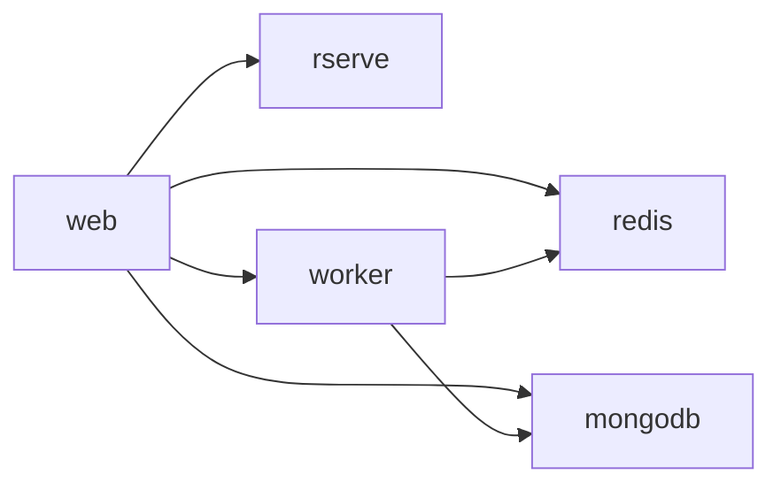

# OpenStudio Server Nomad Pack — Operations Guide

This page is the single entry point for all operational documentation. Each section below
describes a topic and links to the dedicated guide that covers it in depth.

---

## Service Topology



The `web` task group blocks on a `prestart` check that waits for `openstudio-db`,
`openstudio-redis`, and `openstudio-rserve` to be healthy in Consul before the web
container starts.

---

## Web Replica Constraint

> [!WARNING]
> **`web_count` must remain `1` (the default).** Setting it higher will silently
> corrupt analysis state.

### Root cause

The OpenStudio Server web process stores uploaded analysis artefacts (input files, result
archives, temporary data) on the **local container filesystem** — typically under
`/mnt/openstudio` when NFS is mounted, or in the allocation's private scratch space when
it is not.  There is no distributed file-locking mechanism protecting these paths.

When `web_count > 1`, each Nomad allocation gets its own isolated view of that filesystem.
A file written by allocation A is invisible to allocation B, so subsequent requests routed
to B fail to find artefacts that A created.  This is the same constraint documented in the
upstream Helm chart (`templates/web/web-hpa.yaml`, `maxReplicas: 1`):

> *"For this to work and have more than 1 web pod we'll need to implement a distributed
> file locking scheme — NFS cannot guarantee file locking using multiple clients."*

The NFS CSI volume (enabled with `nfs_shared_volume_enabled = true`) provides shared
storage, but it does **not** provide advisory file locks across clients: concurrent
writers can still race and corrupt state.

### How to relax this constraint

Two architectural changes are required before `web_count > 1` is safe:

| Approach | What is needed |
|---|---|
| **Distributed lock manager** | Wrap every filesystem operation in the web process with an atomic lock acquired via a distributed backend (e.g. [Redlock](https://redis.io/docs/latest/develop/use/patterns/distributed-locks/) over the existing Redis instance). All replicas share the same NFS volume; the lock prevents concurrent writes to the same path. |
| **Stateless file handling** | Eliminate local-disk writes from the request path by moving all persistent artefacts to object storage (e.g. Amazon S3, MinIO, or an S3-compatible endpoint). The web process becomes fully stateless and any number of replicas can run safely. |

Until one of these approaches is implemented in the upstream OpenStudio Server
application, keep `web_count = 1`.

---

## Docker User and Alloc-Dir Bind Mounts

### The `docker_user` Variable

All service tasks (web, web-background, worker, db, redis, rserve) support a
`docker_user` variable that controls the UID:GID the container runs as:

- **Default (non-production):** `"1000:1000"` — runs as a non-root user.
- **Production override (`openstack-production.hcl`):** `""` (empty string) — runs
  as root inside the container. This is required because the OpenStudio Server
  image expects root for certain operations (e.g., writing to `/opt/openstudio`,
  binding to privileged ports).

> [!WARNING]
> When `docker_user = ""`, the container runs as root. Any prestart tasks that
> `chown` directories for the container must handle this case explicitly —
> `chown` with an empty owner argument fails with "missing operand".

### Container Security Model (root + capability hardening) — CURRENT APPROACH

The stock `nrel/openstudio-server:<version>` image's `rails-entrypoint` **requires
root and a writable rootfs**:

1. It `mkdir`/`chmod 777` root-owned paths (`/mnt/openstudio/server/{analyses,R,assets}`,
   `/opt/openstudio/server/tmp`, `/mnt/coredumps/`, `/opt/openstudio/server/log`).
2. It rewrites `/opt/nginx/conf/nginx.conf` **in place** (`rm` + `awk` substitution
   of `MAX_REQUESTS`/`MAX_POOL`), so `docker_readonly_rootfs = true` cannot be used.

Running the containers as uid `1000:1000` with a read-only rootfs was investigated
and is **not achievable with the stock image** — the entrypoint fails with
`EACCES`/"Read-only file system" errors (Rails `docker.log`, nginx.conf rewrite).
Enabling it would require a patched image that pre-chowns image paths and injects
`/opt/nginx/conf/nginx.conf` via a writable mount.

**Current, supported hardening for this deployment:** run as root with only the
minimal Linux capabilities the stack needs:

```hcl
docker_user            = ""          # required by image entrypoint
docker_readonly_rootfs = false       # required — entrypoint rewrites nginx.conf in place
docker_cap_drop        = ["ALL"]     # drop ~30 capabilities
docker_cap_add = [                   # minimal verified set for nginx/Passenger/rake
  "CHOWN",             # nginx chowns client_body_temp to nobody
  "FOWNER",            # entrypoint file ops
  "DAC_OVERRIDE",      # entrypoint file ops
  "SETUID",            # nginx/Passenger worker privilege drop
  "SETGID",            # nginx/Passenger worker privilege drop
  "NET_BIND_SERVICE",  # bind container port 80
]
```

Verified in-container (`CapEff = 0x4cb` = exactly the 6 caps above; Docker default
seccomp profile active). A prestart task that `chown`s paths has **no effect** on the
application container's filesystem (it runs in its own container) and must not be
used as a substitute for this model.

### Alloc-Dir Bind Mount Pattern (Symlink Approach)

**Problem:** Nomad's HCL parser does not interpolate `${alloc.dir}` or
`${alloc.id}` inside `docker` driver `mounts[].source`. The `${NOMAD_ALLOC_DIR}`
environment variable expands to `/alloc` at parse time (a static string), not the
real allocation directory path.

**Solution:** Use a prestart task to:
1. Create the real directory under `${NOMAD_ALLOC_DIR}` (shell expands this at runtime)
2. Create a fixed symlink at `/opt/nomad/<symlink-name>` pointing to it
3. Use the fixed symlink path in `mounts[].source`

This pattern is encapsulated in the `openstudio_server.alloc_dir_prestart`
helper template:

```hcl
# In task group (prestart task):
[[ template "openstudio_server.alloc_dir_prestart" (dict
  "symlink_name" "nginx-temp-openstudio-web"
  "dir_path" "tmp/nginx-body-temp"
  "docker_user" (var "docker_user" .)
) ]]

# In docker task config:
mounts = [
  { type = "bind", source = "/opt/nomad/nginx-temp-openstudio-web", target = "/opt/nginx/client_body_temp" }
]
```

The helper handles the `docker_user = ""` case by falling back to `65534:65534`
(the `nobody`/`nogroup` UID:GID that nginx workers run as).

### NFS Preflight Check

When `nfs_shared_volume_enabled = true`, the web task group includes an
`nfs-preflight` prestart task (via `openstudio_server.nfs_preflight_task`)
that verifies the NFS mount point exists and is writable before the web
container starts. This prevents the silent data-loss scenario where the NFS
mount is missing and writes fall through to the local root filesystem.

The check uses `mountpoint -q` and `[ -w ]` with a configurable timeout.
Control the behavior with `web_wait_for_deps_proceed_on_timeout` (default
`false` — fail fast if NFS is not ready).

## Guides

### 🚀 Getting Started: Single-Node Dev Cluster

**[docs/modelers/getting-started-single-node.md](../modelers/getting-started-single-node.md)**

Start here if you are deploying for the first time on a developer laptop or a single-node test
environment. Covers:

- Prerequisites (Nomad, Consul, CNI plugins, Docker, nomad-pack versions)
- Agent config snippets for macOS and Linux with `host_volume` enabled
- Full `nomad-pack run` command with a minimal override file
- How to verify all six services reach `running`
- Access instructions for the OpenStudio Server web UI
- Common errors and their fixes (port conflicts, volume permission denied, image pull failures)

---

### 💾 Storage Preparation

**[docs/infrastructure/storage.md](./storage.md)**

Covers everything you need to provision persistent storage *before* running `nomad-pack run`:

- Step-by-step instructions for registering a CSI plugin job and verifying plugin health
- `host_volume` stanza configuration for the Nomad client agent config
- Persistent volume examples for MongoDB and Redis data directories
- Volume permissions and UID/GID ownership requirements per service container
- Teardown and cleanup steps to avoid orphaned volumes

---

### 📋 Variable Reference

**[docs/variables.md](../variables.md)**

Full reference for every pack variable sourced directly from `packs/openstudio-server/variables.hcl`:

- Complete table: name, type, default, description, example override
- Annotated override file examples: minimal dev, production HA, air-gapped/private-registry
- Notes on variable interactions (e.g., `worker_count` vs. resource limits, Vault toggle flow)

---

### 🔐 Nomad ACL Policy Setup

**[docs/infrastructure/acl-policies.md](./acl-policies.md)**

Minimum ACL capabilities required to deploy and manage this pack:

- HCL policy files for operator, read-only, and CI/CD service token roles
- Commands to create policies and generate tokens
- Scoping policies to a specific Nomad namespace

---

### 🔑 Vault Policy Setup

**[docs/infrastructure/vault-policies.md](./vault-policies.md)**

HashiCorp Vault integration for secrets management:

- Vault policy HCL for each service that reads secrets (web, web-background, worker)
- `vault` stanza with `change_mode` and `change_signal` examples
- Nomad ≥ 1.7 labeled `vault` block vs. legacy Nomad < 1.7 stanza syntax
- KV v2 secret path conventions and token TTL / renewal recommendations
- Enabling the Nomad secrets engine in Vault

---

### 🔄 Kubernetes-to-Nomad Migration

**[docs/infrastructure/migration-k8s-to-nomad.md](./migration-k8s-to-nomad.md)**

Step-by-step migration from the [NREL openstudio-server Helm chart](https://github.com/NREL/openstudio-server):

- Pre-migration checklist: data backups, DNS/Consul service name mapping, image registry access
- Side-by-side Helm `values.yaml` → Nomad Pack variable mapping table
- MongoDB data migration (mongodump / mongorestore with volume mount examples)
- Redis persistence migration steps
- Post-migration smoke-test commands for all six services
- Rollback procedure if migration fails

---

## Nomad Autoscaler Integration

> [!IMPORTANT]
> **Prerequisite: Nomad Autoscaler daemon must be deployed before enabling worker autoscaling.**  
> If `worker_autoscaling_enabled = true` but the daemon is not running, Nomad silently ignores the `scaling` block and worker count remains fixed.  
> Recommended path: deploy the [official Nomad Autoscaler pack](https://developer.hashicorp.com/nomad/tools/autoscaling/deployment/nomad).
>
> **CPU scaling (`worker_autoscaling_cpu_enabled`) uses the `nomad-apm` source** and reads metrics directly from the Nomad API — no Prometheus is required.  
> **Prometheus is required only for queue-depth scaling** (`worker_queue_requeued_query` / `worker_queue_simulations_query`). You can enable CPU autoscaling without a Prometheus stack.

This pack also ships an optional stub at `packs/openstudio-server/templates/nomad-autoscaler.nomad.tpl` gated by `nomad_autoscaler_enabled = false`. The stub defaults to the `nomad-apm` source and includes comments showing where to add an optional Prometheus source.

When worker autoscaling is enabled, this pack now includes a built-in `nomad-apm` CPU check (`avg_cpu`) as the primary simple-scaling path. This requires no external metrics stack and is controlled by `worker_autoscaling_cpu_enabled` and `worker_cpu_target_utilization` (default `50`, matching Helm HPA behavior). Existing Prometheus queue-depth checks remain available for advanced backlog-aware tuning.

### Cloud node pool autoscaling

In Kubernetes, worker pod autoscaling (HPA) and node autoscaling (Cluster Autoscaler annotations)
are separate systems. In Nomad, the **Nomad Autoscaler daemon** can manage both workload scaling and
cluster capacity scaling from one place.

For cloud-backed worker nodes, add a target policy that scales your node pool directly (for example
an AWS Auto Scaling Group):

```hcl
target "aws-asg" {
  dry-run = "false"             # Set true to validate policy behavior safely
  aws_region = "us-east-1"      # Region containing the ASG
  asg_name   = "nomad-clients"  # ASG backing Nomad client nodes
}
```

Use the same pattern for GCP Managed Instance Groups with the `gce-mig` target plugin.

> **Tip:** `packs/openstudio-server/templates/nomad-autoscaler.nomad.tpl` includes ready-to-uncomment `target "aws-asg"` and
> `target "gce-mig"` stanzas inside the inline `autoscaler.hcl` config block. Uncomment and fill in
> the appropriate fields for your cloud provider — no HCL needs to be written from scratch.

See:

- Nomad Autoscaler AWS ASG target:
  [developer.hashicorp.com/nomad/tools/autoscaling/plugins/target/aws-asg](https://developer.hashicorp.com/nomad/tools/autoscaling/plugins/target/aws-asg)
- Nomad Autoscaler GCE MIG target:
  [developer.hashicorp.com/nomad/tools/autoscaling/plugins/target/gce-mig](https://developer.hashicorp.com/nomad/tools/autoscaling/plugins/target/gce-mig)

For Kubernetes `cluster-autoscaler.kubernetes.io/safe-to-evict: "false"` equivalence during node
termination, protect critical tasks with Nomad controls such as:

- `max_client_disconnect` (allow temporary client loss without immediate replacement)
- `prevent_reschedule_on_lost` (avoid automatic rescheduling after client loss)

---

## Worker Effectiveness Monitoring

> **Incident lesson (2026-08-04):** worker count alone is not a health signal. A cluster can show thousands of `running` workers while many are crash-looping or stuck before they complete useful work.

Use the following categories instead of a single worker-count panel:

| Category | Nomad detection | Resque detection | Prometheus / logs |
|---|---|---|---|
| **Starting / scheduling** | `nomad job allocs <job_name>-worker` shows allocs in `pending` / `starting` / `queued` | N/A | `sum(nomad_nomad_job_summary_queued{job="<job_name>-worker"})` when `prometheus_scrape_nomad_enabled = true` |
| **Crash-looping** | `nomad alloc status <alloc_id>` shows repeated restart events or high `Restarts` | Usually absent from `/resque/working` because the worker never stabilizes | Nomad scrape can show elevated `failed` ratio, but restart count is best confirmed in Nomad UI / CLI |
| **Initialization-blocked** | Alloc is `running`, but task has no recent useful log progress | `/resque/working` shows the same data point IDs for a long time while processed completions stay flat | `queue_divergence_alert`, `stall_watchdog_alert`, and low completion throughput |
| **Actively processing** | Alloc is `running` and stable | `/resque/working` has active workers and processed counter is increasing | `working_count - blocked_count` in Grafana; use throughput panel to confirm forward progress |
| **Recently completed** | N/A | Resque processed counter is increasing | `delta(redis_key_value{key="resque:stat:processed"}[5m]) / 5` |

### Nomad CLI checks

List current worker alloc state, restart count, and task state:

```bash
nomad job allocs -json <job_name>-worker | jq -r '
  .[] | [
    .ID[0:8],
    .ClientStatus,
    (.TaskStates.worker.State // "n/a"),
    (.TaskStates.worker.Restarts // 0)
  ] | @tsv'
```

Interpretation:

- `pending`, `starting`, or `queued` allocs = **starting / scheduling**
- `running` with `Restarts > 0` climbing rapidly = **crash-looping**
- `running` with `Restarts = 0` is only a liveness signal; it does **not** prove useful work

For a suspicious alloc, inspect recent task events:

```bash
nomad alloc status <alloc_id>
```

Look for:

- repeated `Restart Signaled` / `Task restarting` events → crash-loop
- long gaps with no new events while the alloc remains `running` → likely initialization-blocked or wedged

### Resque dashboard checks

Use the web UI's Resque dashboard to separate "alive" workers from "useful" workers:

- **`/resque/working`**: current workers holding jobs. If the same data point IDs remain here for longer than your stall threshold (default pack watchdog threshold: `stall_watchdog_max_stall_seconds = 1800`), treat them as **initialization-blocked** until proven otherwise.
- **`/resque/stats`** (or the counters at the top of the Resque UI): `Processed` should keep increasing during healthy steady-state execution.
- **`/resque/failed`**: rising failure count plus stable or falling processed count usually indicates crash-looping or bad worker rollout.

Fast CLI equivalents:

```bash
redis-cli -h <redis-host> get resque:stat:processed
redis-cli -h <redis-host> get resque:stat:failed
```

Sample the counters twice, five minutes apart:

- `processed` rising → workers are completing useful work
- `processed` flat while `/resque/working` stays non-empty → likely **initialization-blocked**
- `failed` rising quickly after new allocations start → likely **crash-looping** or bad startup configuration

### Queue health alert job

The pack now ships `packs/openstudio-server/templates/queue-health-alert.nomad.tpl`, which
renders `<job_name>-queue-health-alert` when `enable_queue_health_alert = true`
(default). The periodic batch task checks Redis queue depth, failed-job depth, active
working workers, and stale `resque:analysis:*:queuing` locks, then emits:

```text
queue_health ts=<epoch> status=ok|alert reasons=<list> simulations=<N> failed=<N> workers_working=<N> stale_locks=<N>
```

Exit behavior is intentional:

- `0`: healthy
- `2`: alert condition matched (`status=alert`) so Nomad marks the batch run as failed
- `1`: script/runtime failure that should be investigated separately

To replace the ad hoc production job, deploy the pack-managed job, confirm
`<job_name>-queue-health-alert` is running on schedule, then stop the manual
`openstudio-queue-health-alert` job so there is only one alert source.

### Structured log metrics available today

The queue-health alert line is the primary maintained signal for queue backpressure. The
pack also emits the following structured worker-effectiveness signals from
`packs/openstudio-server/templates/queue-sweeper.nomad.tpl`, which remain suitable for
Vector/Loki/Grafana log panels:

- `queue_health_status depth=<n> failed_depth=<n> processed_total=<n> failed_total=<n> workers_running=<n> total_allocs=<n> velocity=<n>`
- `queue_stagnation_alert depth=<n> velocity=<n> duration_min=<n> threshold_min=<n> workers_running=<n>`
- `failed_jobs_acceleration_alert delta=<n> threshold=<n> window_min=<n> failed_total=<n>`
- `worker_crashloop_alert rate=<n> threshold=<n> crashloop_allocs=<n> total_allocs=<n> allocs=<id,id>`
- `worker_stuck_scheduling_alert count=<n> threshold_min=<n> allocs=<id,id> max_age_min=<n>`
- `stall_watchdog_status completed=<n> started=<n> total=<n>`
- `stall_watchdog_sample_summary checked=<n> stalled=<n>`
- `stall_watchdog_alert stalled_count=<n> restart_allocs=<true|false>`
- `queue_divergence_alert stale_started=<n> threshold=<seconds>s action=<restart_workers|alert_only>`
- `stall_watchdog_summary stalled_dps=<n> allocs_stopped=<n>`
- `queue_sweeper_lock_summary found=<n> cleared=<n>`
- `queue_sweeper_replay_summary replayed=<n> skipped=<n>`
- `queue_sweeper_summary locks_cleared=<n> replayed=<n>`

Recommended log-derived panels:

- **Queue stagnation**: count `queue_stagnation_alert` and graph `depth` + `velocity`
- **Crash-loop rate**: count `worker_crashloop_alert` and graph `rate`
- **Stuck scheduling**: count `worker_stuck_scheduling_alert` and graph `max_age_min`
- **Blocked workers / stalled data points**: count `queue_divergence_alert` and graph `stale_started`
- **Auto-recovery activity**: graph `stall_watchdog_summary.allocs_stopped`
- **Queue replay rate**: graph `queue_sweeper_replay_summary.replayed`

### On-call routing for queue-health alerts

`<job_name>-queue-health-alert` is a periodic Nomad batch job, so every `exit 2` run is
visible as a failed batch execution in the Nomad UI/API. Route that failure state into
your existing operational notification path in one of two ways:

1. **Nomad job-failure path**: alert when the latest periodic run of
   `<job_name>-queue-health-alert` is `dead/failed` or when the `check-queue-health`
   task exits `2`. This is the best path when you already consume Nomad allocation or
   job events for Slack, PagerDuty, or email.
2. **Structured-log path**: alert on `queue_health ... status=alert` log lines. This is
   the best path when Vector/Loki/ELK already ingest Nomad allocation logs.

Example checks:

```bash
nomad job status <job_name>-queue-health-alert
nomad alloc status <alloc_id>
```

#### Example Vector webhook route

If you already collect Nomad allocation logs with Vector, filter the alert lines and post
them to a webhook receiver:

```toml
[transforms.queue_health_alerts]
type = "filter"
inputs = ["nomad_alloc_logs"]
condition = '''
starts_with(string!(.message), "queue_health ") &&
contains(string!(.message), "status=alert")
'''

[sinks.queue_health_webhook]
type = "http"
inputs = ["queue_health_alerts"]
uri = "https://alerts.example.com/openstudio/queue-health"
method = "post"
encoding.codec = "json"
request.headers.Content-Type = "application/json"
```

This generic webhook can fan out to:

- **Slack**: post to an internal relay or add a small Vector remap so the body matches a
  Slack incoming-webhook payload (`{"text":"..."}`).
- **PagerDuty**: point the HTTP sink (or webhook relay) at the PagerDuty Events v2 API
  and map the `queue_health` fields into `payload.summary`, `payload.severity`, and
  `custom_details`.
- **Email**: route the webhook into your mailer/Alertmanager bridge and send the same
  structured event to an on-call distribution list.

### Prometheus queries (`prometheus_enabled = true`)

The in-pack `prometheus.nomad.tpl` deploys a Redis exporter sidecar. It now scrapes:

- queue depths: `resque:queue:simulations`, `resque:queue:requeued`, `resque:failed`
- Resque counters: `resque:stat:processed`, `resque:stat:failed`

That makes queue throughput visible without any app-code change.

#### Queue throughput / effectiveness

Completions per minute:

```promql
clamp_min(sum(delta(redis_key_value{key="resque:stat:processed"}[5m])), 0) / 5
```

Failures per minute:

```promql
clamp_min(sum(delta(redis_key_value{key="resque:stat:failed"}[5m])), 0) / 5
```

Simulation queue depth:

```promql
sum(redis_key_size{key="resque:queue:simulations"}) or vector(0)
```

Requeued queue depth:

```promql
sum(redis_key_size{key="resque:queue:requeued"}) or vector(0)
```

Queue velocity (positive = backlog growing, negative = backlog draining):

```promql
(sum(delta(redis_key_size{key="resque:queue:simulations"}[10m])) or vector(0)) / 10
```

Queue stagnation detector (mirrors the new periodic batch alert job):

```promql
(
  (sum(redis_key_size{key="resque:queue:simulations"}) or vector(0)) > 0
  and
  clamp_min(sum(delta(redis_key_value{key="resque:stat:processed"}[10m])), 0) == 0
)
```

Failed jobs accelerating:

```promql
clamp_min(sum(delta(redis_key_value{key="resque:stat:failed"}[5m])), 0)
```

#### Nomad worker state (requires `prometheus_scrape_nomad_enabled = true`)

Workers waiting to schedule / start:

```promql
sum(nomad_nomad_job_summary_queued{job="<job_name>-worker"})
```

Current failed-alloc ratio (best lightweight proxy for startup failure pressure with the built-in Nomad scrape):

```promql
sum(nomad_nomad_job_summary_failed{job="<job_name>-worker"})
/
clamp_min(
  sum(nomad_nomad_job_summary_running{job="<job_name>-worker"})
  + sum(nomad_nomad_job_summary_failed{job="<job_name>-worker"})
  + sum(nomad_nomad_job_summary_queued{job="<job_name>-worker"}),
  1
)
```

> **Note:** the in-pack Prometheus scrape exposes job-summary gauges, not per-allocation restart counters. Use `nomad alloc status` for exact crash-loop confirmation.

#### Interpreting the combined signals

- **High queued allocs + low throughput** → scheduler bottleneck or startup failure
- **Low queued allocs + high failed ratio** → crash-looping worker rollout
- **Healthy running count + flat throughput + non-empty `/resque/working`** → initialization-blocked workers
- **Negative queue velocity + rising completions/min** → genuinely healthy worker fleet

### Grafana panel starter snippet

Use a single dashboard row named **Worker Effectiveness** with these panels:

```json
[
  {
    "title": "Completions / min",
    "type": "timeseries",
    "targets": [
      { "expr": "clamp_min(sum(delta(redis_key_value{key=\"resque:stat:processed\"}[5m])), 0) / 5" }
    ]
  },
  {
    "title": "Queue Velocity (simulations / min)",
    "type": "timeseries",
    "targets": [
      { "expr": "(sum(delta(redis_key_size{key=\"resque:queue:simulations\"}[10m])) or vector(0)) / 10" }
    ]
  },
  {
    "title": "Workers Waiting to Start",
    "type": "stat",
    "targets": [
      { "expr": "sum(nomad_nomad_job_summary_queued{job=\"<job_name>-worker\"})" }
    ]
  },
  {
    "title": "Failed Alloc Ratio",
    "type": "stat",
    "targets": [
      { "expr": "sum(nomad_nomad_job_summary_failed{job=\"<job_name>-worker\"}) / clamp_min(sum(nomad_nomad_job_summary_running{job=\"<job_name>-worker\"}) + sum(nomad_nomad_job_summary_failed{job=\"<job_name>-worker\"}) + sum(nomad_nomad_job_summary_queued{job=\"<job_name>-worker\"}), 1)" }
    ]
  }
]
```

Add a companion Loki / log panel for `queue_divergence_alert` or `stall_watchdog_alert` so operators can immediately tell the difference between "many workers exist" and "many workers are actually making progress."

## Alert Routing

There are now three practical routing surfaces for worker-effectiveness alerts:

1. **Prometheus + Alertmanager** (`prometheus_enabled = true`):
   - `OpenStudioQueueStagnation`
   - `OpenStudioFailedJobsAccelerating`
   - `OpenStudioWorkerAllocHighFailureRate`
   - `OpenStudioWorkerQueuedTooLong`
   Route these through Alertmanager receivers for PagerDuty, Slack, or email.
2. **Structured logs via Vector/Loki**:
   Match `*_alert` log lines from the `queue-sweeper` periodic job (`queue_stagnation_alert`, `worker_crashloop_alert`, `worker_stuck_scheduling_alert`, `failed_jobs_acceleration_alert`, `stall_watchdog_alert`, `queue_divergence_alert`) and route them to your log alerting backend.
3. **Nomad job failure exit codes**:
   The `queue-health-alert` task exits `2` when it emits a worker/queue alert and `1` on execution failure. If you already stream Nomad job status events, treat `openstudio-server-queue-sweeper` periodic allocation failures as a notification source and include the allocation logs in the alert payload.

Minimum recommended production wiring:

- PagerDuty: route `severity=critical` Prometheus alerts and `worker_crashloop_alert` / `queue_stagnation_alert` log matches.
- Slack / email: route warning-level `OpenStudioWorkerQueuedTooLong` and `failed_jobs_acceleration_alert`.
- Alert payload fields to preserve: job name, worker alloc IDs, queue depth, queue velocity, processed delta, failed delta, and threshold minutes/restart count.

If ACLs are enabled, ensure the alerting job can read Nomad allocation state by providing a suitable `NOMAD_TOKEN` in the task environment or by running on a Nomad client with localhost API access that permits read-only allocation inspection.

---

## Canary Rollout Procedure

Worker updates now gate promotion on Nomad service checks. The worker readiness check verifies
that `db`, `queue`, and `rserve` are reachable over TCP and that the allocation still has a
Resque worker process, so unhealthy canaries fail before full promotion.

### Monitor the canary

List deployments and capture the worker deployment ID:

```bash
nomad deployment list
```

Inspect the canary in detail:

```bash
nomad deployment status <deployment-id>
```

Healthy canaries must stay healthy for at least `worker_min_healthy_time` (default `2m`)
before they are eligible for promotion.

### Promote a healthy canary

When `worker_auto_promote = false` (the default), promote manually after reviewing canary
health and logs:

```bash
nomad deployment promote <deployment-id>
```

### Fail and auto-revert a bad canary

If the canary fails health checks or shows bad startup behavior, fail the deployment:

```bash
nomad deployment fail <deployment-id>
```

The pack hardcodes `auto_revert = true` for worker updates, so Nomad automatically returns
the job to the last stable worker version after the failed deployment is marked unhealthy.

### When to use `worker_auto_promote`

- Keep `worker_auto_promote = false` for production, high-scale fleets, first-time image or
  config changes, and any rollout where an operator should inspect canaries before promotion.
- Set `worker_auto_promote = true` only for low-risk repeat rollouts after validating that
  the worker readiness check is reliably catching dependency and startup regressions.

---

## Quick-Reference: Pack Variables

| Variable | Default | What it does |
|----------|---------|--------------|
| `job_name` | `openstudio-server` | Nomad job name |
| `datacenters` | `["dc1"]` | Eligible datacenters |
| `worker_count` | `1` | Number of worker replicas |
| `worker_autoscaling_enabled` | `false` | Enable Nomad Autoscaler |
| `db_storage_type` | `host_volume` | `host_volume`, `csi`, or `ephemeral` |
| `redis_storage_type` | `host_volume` | `host_volume`, `csi`, or `ephemeral` |
| `vault_integration_enabled` | `false` | Enable Vault KV secret template injection (`secrets/env`) |
| `vault_enabled` | `false` | Enable explicit role-based Vault blocks in tasks |
| `enable_consul_connect` | `false` | Enable Consul Connect mTLS mesh |
| `backup_enabled` | `false` | Enable MongoDB backup batch job |

See the full reference in [docs/variables.md](./variables.md).

---

## Deployment Checklist

Before running `nomad-pack run` for the first time:

- [ ] Nomad cluster is running and all client nodes are `ready`
- [ ] Consul is running and the Nomad–Consul integration is configured
- [ ] `host_volume` stanzas are added to every eligible Nomad client config **and** the client has been reloaded, _or_ CSI volumes are registered
- [ ] Volume directories exist and are owned by UID/GID `999` (MongoDB and Redis container user)
- [ ] Docker can pull required images on every Nomad client node
- [ ] If ACLs are enabled: operator token exported as `NOMAD_TOKEN`
- [ ] If Vault is enabled: secrets written to the correct KV v2 paths and Nomad policies applied
- [ ] If `worker_autoscaling_enabled = true`: Nomad Autoscaler is deployed and running

### OpenStack reliability checks (recommended cadence)

Run these from the pack root after bootstrap/deploy and then on a schedule (for example, every 15 minutes for ingress and daily for audits):

```bash
# Ingress route + external URL + Traefik metrics endpoint
make os-ingress-check

# Reconcile jump-host Traefik config to managed baseline, then validate ingress
make os-traefik-reconcile

# Verify critical jobs are constrained to the intended node_role
make os-conformance-audit

# Report low-disk Nomad clients before ENOSPC causes allocation failures
make os-disk-audit

# Audit legacy/orphan jobs that can trigger pack metadata drift
make os-legacy-job-audit

# Verify required ingress + periodic OpenStudio alert rules are loaded
PROMETHEUS_URL=http://<prometheus-host>:9090 make os-alerts-check

# Check recent queue-sweeper/watchdog Consul transient warning rate
make os-consul-transient-check
```

To automatically quarantine low-disk nodes, run:

```bash
NOMAD_ADDR=http://127.0.0.1:4646 \
JUMP_HOST=ubuntu@10.60.105.39 \
NOMAD_SERVER_HOST=ubuntu@10.60.126.125 \
./scripts/remediate-low-disk-nodes.sh --apply --drain --threshold-mb 20480
```

By default, the script will **not** quarantine `node_role=web` nodes. Override only when you have replacement web-role capacity:

```bash
./scripts/remediate-low-disk-nodes.sh --apply --drain --threshold-mb 20480 --allow-web-role-quarantine
```

---

## Disk Reservation — Automatic Node Ineligibility

> **Root cause (2026-08-03 incident):** Two Nomad client nodes filled their 242 GiB disks
> entirely (ENOSPC) during a single large simulation run. Nomad continued scheduling allocs
> onto them until all disk writes failed. No automatic ineligibility was triggered.

### Configure `reserved.disk` on every Nomad client

Add (or update) the following in each client's Nomad configuration file
(typically `/etc/nomad.d/client.hcl`):

```hcl
client {
  reserved {
    # 20 GiB in MiB — Nomad stops scheduling new allocs when free disk drops below this.
    # Set to the minimum headroom required for OS/system operation plus one alloc worth
    # of ephemeral scratch space.
    disk = 20480
  }
}
```

After editing, reload the Nomad agent:

```bash
systemctl reload nomad
# or (if reload is not supported)
systemctl restart nomad
```

**Verify the threshold is active:**

```bash
# Check the node's reserved disk field
nomad node status -json <node_id> | jq '{
  disk_free_mb: .NodeResources.Disk.DiskMB,
  reserved_disk_mb: .Reserved.DiskMB
}'
```

> **Nomad Vagrant cluster:** Update `vagrant/provision/nomad-client.sh` to include the
> `client.reserved.disk` stanza in the generated `client.hcl` so new nodes provisioned
> by Vagrant inherit this setting automatically.

### Disk sizing recommendation

For large simulation runs (100,000+ data points), 250 GiB per node is insufficient.
See [storage.md — Disk Sizing for Large Simulation Runs](./storage.md#disk-sizing-for-large-simulation-runs)
for per-DP footprint estimates and recommended node sizes.

---

## Scaling Workers When a Deployment Is Stuck

> **Root cause (2026-08-03 incident):** `nomad job scale` is blocked when an active
> deployment is in-flight. The correct workaround is non-obvious and critical.

### Do NOT use `nomad deployment pause`

`pause` suspends health evaluation but does **not** release the scaling lock. `nomad job scale`
will still return `job scaling blocked due to active deployment`.

### Correct procedure

1. **Identify the stuck deployment:**
   ```bash
   nomad job deployments openstudio-server-worker
   ```

2. **Fail the deployment** (releases the scaling lock immediately):
   ```bash
   nomad deployment fail <deployment_id>
   ```

3. **Snapshot the current job spec:**
   ```bash
   nomad job inspect -json openstudio-server-worker > /tmp/worker_job.json
   ```

4. **Edit the desired count:**
   ```bash
   # Set TaskGroups[0].Count to the desired scale (e.g. 250)
   python3 -c "
   import json, sys
   j = json.load(open('/tmp/worker_job.json'))
   j['TaskGroups'][0]['Count'] = 250
   json.dump(j, sys.stdout)
   " > /tmp/worker_job_scaled.json
   ```

5. **Strip read-only fields** (Nomad rejects them on submit):
   ```bash
   python3 -c "
   import json, sys
   j = json.load(open('/tmp/worker_job_scaled.json'))
   for field in ['CreateIndex','ModifyIndex','JobModifyIndex','Version','SubmitTime','Status','StatusDescription','Stable']:
       j.pop(field, None)
   json.dump({'Job': j}, sys.stdout)
   " > /tmp/worker_payload.json
   ```

6. **Submit via the Nomad API:**
   ```bash
   curl -X POST ${NOMAD_ADDR}/v1/jobs \
     -H 'Content-Type: application/json' \
     -d @/tmp/worker_payload.json
   ```

### Autoscaler blocked — force immediate scale-up with `max_parallel=0`

> **Root cause (2026-08-03 incident, repeated):** The Nomad Autoscaler will not evaluate
> scaling policies while a deployment is `running`. With `max_parallel=1` (the normal safe
> setting), a rolling update of N workers takes N × `min_healthy_time` minutes.

When you need workers to scale up immediately and an active deployment is blocking the
autoscaler:

1. **Confirm autoscaler is blocked:**
   ```bash
   nomad job deployments openstudio-server-worker | head -5
   # Should show a deployment in "running" state
   ```

2. **Push a new version with `max_parallel=0`** (unlimited parallel — all allocs replaced
   simultaneously) and the desired seed count:
   ```bash
   NOMAD_ADDR=http://<nomad-server>:4646 nomad-pack render \
     --var-file examples/advanced/openstack-production.hcl \
     --var-file examples/advanced/openstack-site-local.hcl \
     --var "enable_image_prepull=false" \
     --var "worker_count=2000" \
     --name openstudio-server . | grep -A9999 "openstudio-server/worker.nomad:" | tail -n +2 \
     | nomad job run -
   ```

   Alternatively, inspect the current spec, patch `MaxParallel=0` and `Count`, then
   submit via the API (same as the "stuck deployment" procedure above).

3. **Immediately restore `max_parallel=1`** once the autoscaler fires (check `nomad job
   deployments` — a new one should appear within 30 s):
   ```bash
   # Render and push the normal worker spec with max_parallel=1
   NOMAD_ADDR=http://<nomad-server>:4646 nomad-pack run \
     --var-file examples/advanced/openstack-production.hcl \
     --var-file examples/advanced/openstack-site-local.hcl \
     --var "enable_image_prepull=false" \
     --name openstudio-server .
   ```

> ⚠️ Never leave `max_parallel=0` in place. A future rolling update will replace all
> running workers simultaneously, causing a complete worker outage during the transition.

## Bulk Worker Drain

Use `scripts/drain-workers.sh` when a rollback or fixed deploy leaves a mixed worker fleet
and you need to stop only the older running allocations in controlled batches.

```bash
scripts/drain-workers.sh \
  --job openstudio-server-worker \
  --target-version 42 \
  --dry-run
```

The dry-run prints one line per matching allocation:

```text
dry_run alloc=<alloc_id> version=<job_version> node=<node_name> desired=run
```

Run the drain live once the target version is confirmed:

```bash
scripts/drain-workers.sh \
  --job openstudio-server-worker \
  --target-version 42 \
  --batch 100 \
  --sleep 20
```

Optional controls:

- `--rounds N`: stop after `N` rounds instead of draining until complete
- `--nomad-addr URL`: override `NOMAD_ADDR`
- `NOMAD_NAMESPACE` / `NOMAD_TOKEN`: passed through to Nomad API requests

Each live round emits structured progress:

```text
round=1 old_running=237 stopped=100
round=2 old_running=137 stopped=100
round=3 old_running=37 stopped=37
```

The script uses `POST /v1/allocation/:id/stop` and finishes with a structured running
version breakdown so operators can confirm whether any pre-target allocations remain.


**Always verify the image immediately after an auto-revert:**

```bash
nomad job inspect openstudio-server-worker | grep -i image
```

Auto-revert restores the last *stable* version — the version that was marked stable
before the current deployment started. If the stable baseline was pinned to an old or
wrong image (e.g. `openstudio-worker:local` absent on most nodes), the revert silently
restores a broken state.

**To update the stable baseline:** deploy the correct image, wait for `min_healthy_time`
to elapse with all allocs healthy, then confirm:

```bash
nomad job history openstudio-server-worker | grep -E "Version|Stable"
```

---

## Pending Application-Level Fixes (openstudio-server repo)

The following bugs were identified during the 2026-08-03 incident. They require changes
in the **`openstudio-server`** application repository (not this pack). Track them as
pull requests against `NREL/openstudio-server`.

### 1. Nil guard in `RunSimulateDataPoint#perform`

**File:** `app/jobs/resque_jobs/run_simulate_data_point.rb`

**Symptom:** If a Resque payload uses the wrong arg format (`args: [analysis_id, dp_id]`
instead of `args: [dp_id]`), `DataPoint.find(analysis_id)` returns `nil`, execution
continues silently, and the DP stays at `na` forever with no error in any log.

**Required change:**

```ruby
# Resque payload format: {"class": "ResqueJobs::RunSimulateDataPoint", "args": ["<data_point_id>"]}
# IMPORTANT: args must contain exactly ONE element (the data_point_id string).
# Passing [analysis_id, data_point_id] causes DataPoint.find(analysis_id) => nil => silent skip.
def self.perform(data_point_id, options = {})
  data_point = DataPoint.find(data_point_id)
  raise ArgumentError, "DataPoint '#{data_point_id}' not found — check Resque payload arg format (must be single dp_id string)" if data_point.nil?
  # ... rest of method unchanged
```

### 2. `batch_run.rb` nil `end_time=` / BSON document key bug

**File:** `app/lib/analysis_library/batch_run.rb` (lines 28 and 82)

**Symptoms:**
- `undefined method 'end_time=' for nil:NilClass` at line 82
- `NilClass instances are not allowed as keys in a BSON document` at line 28

**Suspected root cause:** The `Job` or `Analysis` record is `nil` at line 82. This
likely occurs when the analysis is in a partially-initialized state (e.g., submitted but
not yet persisted, or deleted between enqueue and execution).

**Required change:** Add nil guards before line 82:

```ruby
# In batch_run.rb around line 82:
raise ArgumentError, "Job record is nil in batch_run at end_time assignment" if job.nil?
job.end_time = Time.now
```

**Live cluster impact:** Analysis `0a6703b4` on the live cluster is permanently failed
due to this bug. Its results are unavailable. Re-initiate from the web UI if required.

---

## Node Replacement

When a Nomad client node is replaced (e.g., an OpenStack VM is terminated and a new VM
joins the cluster with a different UUID), any CSI volume that was pinned to the old node
via `topology_required` will become unschedulable. This section describes how to detect
the staleness and restore service.

### Detection

**Step 1 — Observe unschedulable DB job:**

```bash
nomad job status openstudio-server-db
```

Look for an allocation stuck in `pending` with a placement failure like:

```
Placement Failure
  Task Group "db" (failed to place 1 allocation):
    * Constraint "topology" filtered 1 nodes
```

**Step 2 — Confirm the volume topology pin is stale:**

```bash
nomad volume status openstudio-mongodb
```

The `Topology` field will list the old node UUID. Compare it against the current client
nodes:

```bash
nomad node status
```

If the node UUID in the volume's topology does not appear in the node list, the pin is
stale and must be updated.

---

### Automated Remediation (preferred)

If you are using the `deploy-openstack.sh` helper script, re-running it with `--deploy`
automatically re-executes preflight with `--rebind-stale --emit-topology-vars` and
re-deploys the pack with updated topology pins:

```bash
./scripts/deploy-openstack.sh --deploy
```

The script performs these steps internally:
1. Runs `preflight-storage.sh --rebind-stale --emit-topology-vars` to detect the new
   node UUID and emit updated `*_csi_topology_node_id` variable values.
2. Passes those values to `nomad-pack run` to update the DB and Redis job topology pins.
3. Validates that the DB and Redis jobs reach a healthy state before returning.

No manual intervention is required when this path is available.

---

### Manual Remediation

Use this path when the automated deploy script is unavailable or when you need to
perform the update step-by-step.

**Step 1 — Re-run preflight to capture the new node UUID:**

```bash
DB_CSI_PLUGIN_ID=hostpath-web-plugin0 \
  ./scripts/preflight-storage.sh \
    --var-file examples/advanced/openstack.hcl \
    --rebind-stale --emit-topology-vars 2>/dev/null \
  | grep _csi_topology_node_id
```

Example output:

```
db_csi_topology_node_id    = "a1b2c3d4-e5f6-7890-abcd-ef1234567890"
redis_csi_topology_node_id = "a1b2c3d4-e5f6-7890-abcd-ef1234567890"
```

**Step 2 — Re-deploy with updated topology pins:**

```bash
nomad-pack run \
  -var-file examples/advanced/openstack.hcl \
  -var "db_csi_topology_node_id=<new-uuid>" \
  -var "redis_csi_topology_node_id=<new-uuid>" \
  --name openstudio-server .
```

Replace `<new-uuid>` with the UUID captured in Step 1.

**Step 3 — Verify recovery:**

```bash
nomad job status openstudio-server-db
nomad job status openstudio-server-redis
```

Both jobs should show all allocations in `running` state within a few minutes.

> **Note:** If `nomad volume status openstudio-mongodb` still shows the old node UUID
> after re-deploying, the CSI plugin may need to be restarted or the volume deregistered
> and re-registered. Consult the [Storage guide](storage.md) for volume lifecycle
> operations.

---

## Teardown Order

Before destroying the pack, stop the stateless jobs first so that all Nomad allocations
reach a terminal state before any downstream cleanup (NFS unmount, volume deletion, etc.).

Use the provided helper script:

```bash
# Default namespace ("default")
./scripts/pre-teardown.sh

# Non-default namespace via flag
./scripts/pre-teardown.sh --namespace openstudio

# Non-default namespace via environment variable
NOMAD_NAMESPACE=openstudio ./scripts/pre-teardown.sh

# Custom job name and namespace
./scripts/pre-teardown.sh --namespace openstudio my-custom-job-name
```

`JOB_NAME` defaults to `openstudio-server`. The namespace defaults to `"default"` but
should match the `nomad_namespace` variable used when the pack was deployed. The script
stops jobs in this order:

1. `<JOB_NAME>-worker` (drains in-flight simulations first)
2. `<JOB_NAME>-web`
3. `<JOB_NAME>-rserve`
4. `<JOB_NAME>-db`
5. `<JOB_NAME>-redis`
6. `<JOB_NAME>-system-hooks` (stopped with `-global`)
7. `<JOB_NAME>-state-backup` (optional, if present)
8. `<JOB_NAME>-state-restore` (optional, if present)
9. `<JOB_NAME>-batch-verify` (optional, if present)
10. `<JOB_NAME>-test` (optional, if present)
11. `<JOB_NAME>-nomad-autoscaler` (optional, if present)
12. `<JOB_NAME>-autoscaler` (legacy optional name, if present)

Then it prints the `nomad-pack destroy packs/openstudio-server` instruction.

> **Note for non-default namespace deployments:** Always pass `--namespace` (or set
> `NOMAD_NAMESPACE`) when the pack was deployed with `nomad_namespace != "default"`.
> Without it, `nomad job stop` targets the `default` namespace and silently succeeds
> without stopping anything.

Once the script exits successfully, run:

```bash
nomad-pack destroy packs/openstudio-server
```

### Why no `sleep`?

The Helm chart's `hooks/pre-delete-hook.yaml` runs `kubectl delete deployment … && sleep 60`
as a workaround for Kubernetes' non-deterministic pod drain timing — there is no blocking
primitive that guarantees pods are dead before the hook exits.

`nomad job stop` is deterministic: it **blocks until every allocation is dead**. No sleep
is needed, making this approach cleaner and more reliable than the Helm equivalent.

---

## Queue-Sweeper / Watchdog Rollout Safety

Use the dedicated runbook for periodic-job rollout checks, forced-run validation, alert
signals, and short-lived allocation forensics:

- [queue-sweeper-watchdog-rollout.md](./queue-sweeper-watchdog-rollout.md)

Critical invariants enforced by the pack:

1. `stall-watchdog` runs only as a task group inside `<job_name>-queue-sweeper` (no standalone job).
2. If both `enable_queue_sweeper` and `enable_stall_watchdog` are true, cron values must match.
3. Transient Consul control-plane throttling (429/5xx) is handled as skip-cycle (exit 0), not hard failure.

---

### Periodic-job operational helpers

```bash
# Capture short-lived periodic alloc evidence before GC removes it
./scripts/capture-periodic-forensics.sh --job-name openstudio-server --namespace default

# Count recent Consul transient warnings in queue-sweeper/watchdog logs
./scripts/check-queue-sweeper-consul-transient-rate.sh --job-name openstudio-server --namespace default
```

---

## `nomad-pack run` Deployment Metadata Drift (`pack.deployment_name`)

Some upgraded environments retain legacy jobs that can break `nomad-pack run` lookups with:

- `Failed To Query For Previously Deployed Jobs`
- `pack.deployment_name` query failures

Safest remediation path implemented in repo scripts:

1. Enforce consolidated scheduler source by purging known legacy standalone job IDs (notably `<job_name>-stall-watchdog`).
2. Retry `nomad-pack run` once after purge.
3. If metadata query still fails but core jobs register successfully, continue with explicit warning.

One-time manual cleanup command (if needed):

```bash
nomad job stop -purge <job_name>-stall-watchdog
```

One-time prefix audit helper (dry-run by default):

```bash
NOMAD_ADDR=http://<nomad-host>:4646 ./scripts/audit-legacy-pack-jobs.sh --job-name <job_name> --namespace <ns>
# Apply safe known-legacy purge set:
NOMAD_ADDR=http://<nomad-host>:4646 ./scripts/audit-legacy-pack-jobs.sh --job-name <job_name> --namespace <ns> --apply
```

---

## Ingress Alerts

The `openstudio_ingress` group in `monitoring/prometheus-alert-rules.yml` provides continuous alerting for Traefik route and backend health.  These fire automatically — no manual `check-openstack-ingress.sh` run required.

### Alert: TraefikRouterMissing (critical)

**Meaning:** The `openstudio-server@consulcatalog` Traefik router has been absent or has had no entry points for 5+ minutes.  All requests will return 404.  This is the primary signal for the class of outage that occurred on 2026-08-03.

**Response steps:**

1. Confirm the Nomad web job is running:
   ```bash
   nomad job status openstudio-server-web
   ```
2. Confirm the Consul service is healthy:
   ```bash
   consul catalog services | grep openstudio
   consul health service openstudio-web
   ```
3. Validate Traefik's Consul Catalog endpoint configuration:
   ```bash
   ./scripts/validate-traefik-consul-endpoint.sh
   ```
4. Run the full ingress smoke check:
   ```bash
   ./scripts/check-openstack-ingress.sh
   # or
   make os-ingress-check
   ```
5. If the Consul provider address is wrong or missing, re-apply the managed Traefik baseline:
   ```bash
   make os-traefik-reconcile
   ```
6. Verify the router is visible in the Traefik API after reconciliation:
   ```bash
   curl -s http://<traefik-host>:8080/api/http/routers | \
     jq '.[] | select(.name | contains("openstudio"))'
   ```

---

### Alert: TraefikIngressHighErrorRate (warning)

**Meaning:** The `openstudio-server@consulcatalog` router is returning HTTP 404 for more than 10 % of requests over a 5-minute window.  The route exists but requests are not matching or the application is returning 404 upstream.

**Response steps:**

1. Check the current router rule (Host/Path/PathPrefix):
   ```bash
   curl -s http://<traefik-host>:8080/api/http/routers | \
     jq '.[] | select(.name | contains("openstudio")) | {name,rule,status}'
   ```
2. Verify the `ingress_domain` variable matches the domain clients are requesting and the Host header is correct:
   ```bash
   ./scripts/check-openstack-ingress.sh
   ```
3. Check application-level 404s in web allocation logs:
   ```bash
   WEB_ALLOC=$(nomad job allocs -json openstudio-server-web | jq -r '.[0].ID')
   nomad alloc logs "$WEB_ALLOC" web | grep " 404 "
   ```
4. If the path prefix has changed, redeploy with the correct `ingress_path_prefix` variable.
5. Escalate to `OpenStudioIngressHigh404Ratio` (entrypoint-level, >30 %) if the issue is not router-specific.

---

### Alert: TraefikBackendUnhealthy (critical)

**Meaning:** Traefik's `traefik_service_server_up` metric reports zero healthy servers for `openstudio-web`.  Every routed request will return 502/503.

**Response steps:**

1. Check the web job allocation:
   ```bash
   nomad job status openstudio-server-web
   nomad alloc status <web-alloc-id>
   ```
2. Inspect Consul health checks for `openstudio-web`:
   ```bash
   consul health service openstudio-web
   ```
3. View web allocation logs for startup errors:
   ```bash
   nomad alloc logs -stderr <web-alloc-id> web
   ```
4. If the allocation is in `failed` or `lost` state, restart the job:
   ```bash
   nomad job stop openstudio-server-web
   nomad-pack run --name openstudio-server packs/openstudio-server
   ```
5. If Consul health checks are failing but the process is running, check the health check endpoint:
   ```bash
   curl -v http://<web-node-ip>:<web_port>/
   ```
6. After the web job recovers, confirm Traefik detects the backend:
   ```bash
   curl -s http://<traefik-host>:8080/api/http/services | \
     jq '.[] | select(.name | contains("openstudio")) | {name, serverStatus}'
   ```

---

### Alert: OpenStudioTraefikConfigReloadFailed (critical)

**Meaning:** `traefik_config_last_reload_success == 0` — Traefik failed to apply its most recent configuration.  The running config is stale; routes may be out of date.

**Response steps:**

1. Check Traefik logs for the parse/validation error:
   ```bash
   nomad alloc logs -stderr <traefik-alloc-id> traefik | tail -50
   ```
2. Validate the static config file:
   ```bash
   traefik healthcheck --configFile /etc/traefik/traefik.yml
   ```
3. Correct the config and force a reconcile:
   ```bash
   make os-traefik-reconcile
   ```

---

### Loading / reloading alert rules

Alert rules are stored in `monitoring/prometheus-alert-rules.yml`.  To deploy them:

```bash
# Copy into the Prometheus config directory on the Prometheus node
scp monitoring/prometheus-alert-rules.yml ubuntu@<prometheus-node>:/etc/prometheus/rules/

# Add to Prometheus rule_files: if not already present:
# rule_files:
#   - /etc/prometheus/rules/prometheus-alert-rules.yml

# Reload Prometheus (no restart required):
curl -X POST http://<prometheus-host>:9090/-/reload

# Confirm rules are loaded:
curl -s http://<prometheus-host>:9090/api/v1/rules | \
  jq '.data.groups[] | select(.name=="openstudio_ingress") | .rules[].name'
```

Expected output includes: `TraefikRouterMissing`, `TraefikIngressHighErrorRate`, `TraefikBackendUnhealthy`, `OpenStudioTraefikConfigReloadFailed`, `OpenStudioIngressNoHealthyBackend`, `OpenStudioIngressHigh404Ratio`.

Validate all required OpenStudio alert rules (ingress + periodic watchdog/sweeper):

```bash
./scripts/check-prometheus-openstudio-rules.sh --prometheus-url http://<prometheus-host>:9090
```

---

## High-scale worker rollout guardrails (5k+ workers)

Use the staged procedure in
[`openstack-staged-rollout-runbook.md`](./openstack-staged-rollout-runbook.md),
including the **runtime discovery canary-first** gate before worker expansion.

Recommended high-scale worker update controls:

- `worker_canary_count=25`
- `worker_update_max_parallel=100`
- `worker_update_stagger="15s"`
- `worker_auto_promote=false`
- `worker_min_healthy_time="1m"`
- `auto_revert=true` (pack-enforced invariant)

Required observability signals during rollout:

- Deployment health: `nomad job deployments <job>-worker`
- Allocation stability: failed/unhealthy alloc rate, restart bursts
- Startup guardrails: `wait_for_deps_timeout`, `*_runtime_resolve_failed`
- Control-plane stress indicators: Consul 429 / template failure recurrences

Rollback path:

1. `nomad job scale <job>-worker 0`
2. `nomad job revert <job>-worker 0` (optional fast rollback)
3. `nomad-pack run --name <job> -var-file <previous-verified-vars> packs/openstudio-server`

---

## Sustainable worker scaling to 5,500 allocations

The worker fleet can legitimately reach 5,500 (the memory-oversubscription
ceiling documented in `examples/advanced/openstack-production.hcl`). The 2026-08-08
incident proved the danger is not the *ceiling* but the *pace*: a deep Redis
backlog combined with a 2m scale-up cooldown mapped the queue to thousands of
desired workers almost instantly (2 → 500 → 5500 in ~10 minutes). The web task
(Passenger/nginx) was saturated — load 154, 4,033 processes, MAX_REQUESTS=5775 —
so the Consul `/status` health check timed out, Consul marked `openstudio-web`
critical, Traefik dropped the route, and the ingress returned a 404 page.

### Pace, not ceiling: the autoscaler knobs that matter

| Variable | Pack default | 5,500-fleet value | Why |
|---|---|---|---|
| `worker_autoscaling_max_scale_delta` | 10 | 10 (raise only with evidence) | Per-cycle allocations; with 60s evaluation the fleet grows at most ~150/15m window |
| `worker_autoscaling_evaluation_interval` | 60s | 60s | Fewer evaluation cycles = less Nomad API + Consul catalog churn at scale |
| `worker_autoscaling_scale_up_cooldown` | 15m | 15m | Rate-limits consecutive scale-up cycles; 2m caused the herd |
| `worker_autoscaling_scale_down_cooldown` | 20m | 20m | Avoids thrash when the queue briefly empties |
| `worker_queue_requeued_target` / `worker_queue_simulations_target` | 20 / 20 | 20 / 20 | `ceil(queue/target)` → desired workers; dividing by 1-3 (the drift) mapped a 32k backlog to ~32k desired workers |
| `worker_min_replicas` | 2 | 50 | Warm floor so a fresh backlog is picked up promptly |

`examples/advanced/scale-to-5500.hcl` documents the complete, corrected
configuration; apply it as a layered var-file after
`openstack-production.hcl`. Always run the staged scale test
(`scripts/scale-test-runbook.sh`, phases 100 → 1,000 → 2,500 → 5,500) after
changing any of these knobs.

### Web resilience (the 404 fix)

The web task is the single ingress choke point; `web_count` must stay 1 (NFS
has no distributed file-locking). Keep it healthy under worker load with:

- **Bound `MAX_REQUESTS`**: set `web_max_requests = 500` instead of the
  auto-derived `ceil(worker_max_replicas * 1.05)` (= 5775 at 5,500 workers).
  Passenger then backpressures instead of accumulating a 5,775-item queue.
- **Resilient health check**: `web_health_check_interval = "30s"`,
  `web_health_check_timeout = "15s"`,
  `web_health_check_success_before_passing = 2`,
  `web_health_check_failures_before_critical = 3`. A transient probe timeout
  under load must not flip Consul critical and drop the Traefik route.
- **Workers must not co-locate with web**: the base profile targets workers to
  `meta.node_role = "worker"` nodes; additionally pin the web/stateful node IDs
  via `worker_excluded_node_ids` so a mislabeled node cannot receive workers.

### Thundering-herd infrastructure

- Point Traefik's Consul Catalog provider at the Consul **server**
  (`traefik_consul_catalog_address = "<server-ip>:8500"`) instead of the local
  agent (`127.0.0.1:8500`) so worker template traffic cannot starve the
  catalog fetch.
- Raise `limits.http_max_conns_per_client` on every Consul agent to
  `ceil(workers_per_node * 4) * 2` (e.g. 1500 for 280 workers/node). Formula
  and application details live in `variables.hcl` under
  `consul_http_max_conns_per_client`; the pack's infra-setup system job applies
  it (requires a Consul agent restart).
- Keep `worker_runtime_image = "openstudio-worker:local"` image prepull so a
  scale-up wave never triggers N simultaneous registry pulls.

---

## Lock Sweeper

The pack now ships a managed `<job_name>-lock-sweeper` periodic batch job in
`packs/openstudio-server/templates/lock-sweeper.nomad.tpl`. It replaces the ad hoc
production job created during the 2026-08-04 incident and removes orphaned
`analysis_zip.lock` files from the shared NFS mount when no matching
`analysis_zip.receipt` exists.

### Default behavior

- Enabled by default with `enable_lock_sweeper = true`
- Runs every 5 minutes via `lock_sweeper_interval`
- Mounts the `lock_sweeper_nfs_volume` host volume at `/mnt/openstudio`
- Treats lock files older than `lock_sweeper_stale_threshold_minutes` as stale
- Emits one structured log line per sweep:
  `lock_sweep ts=<epoch> stale_before=<n> removed=<n> stale_after=<n>`

### Configuration

| Variable | Default | Purpose |
|---|---:|---|
| `enable_lock_sweeper` | `true` | Enable or suppress rendering of the lock-sweeper job. |
| `lock_sweeper_interval` | `"*/5 * * * *"` | UTC cron for the periodic batch job. |
| `lock_sweeper_stale_threshold_minutes` | `15` | Minimum age before an orphaned `analysis_zip.lock` file is deleted. |
| `lock_sweeper_nfs_volume` | `"openstudio-nfs"` | Nomad host volume name mounted at `/mnt/openstudio`. |

Disable the job for environments that do not mount the shared NFS host volume:

```bash
nomad-pack render -var "enable_lock_sweeper=false" packs/openstudio-server
```

If your cluster uses a different host volume name, override it at deploy time:

```bash
nomad-pack run -var "lock_sweeper_nfs_volume=<your-nfs-host-volume>" packs/openstudio-server
```

### Verification

Confirm the job is registered and scheduled:

```bash
nomad job status <job_name>-lock-sweeper
```

Inspect the most recent sweep log output:

```bash
nomad job history <job_name>-lock-sweeper
nomad alloc logs <alloc_id> lock-sweeper
```

After deploying the pack-managed job, purge the old hand-created production job so only
`<job_name>-lock-sweeper` remains as the source of truth.

## Incident Response Runbooks

Use these runbooks for production incident diagnosis and recovery:

- [runbooks/queue-stall.md](./runbooks/queue-stall.md) — diagnose queue growth, identify
  bad worker versions, clear stale `analysis_zip.lock` files, drain old worker
  allocations safely, and validate recovery.

## Further Reading

- [Nomad Pack documentation](https://developer.hashicorp.com/nomad/tools/nomad-pack)
- [Nomad documentation](https://developer.hashicorp.com/nomad/docs)
- [Consul documentation](https://developer.hashicorp.com/consul/docs)
- [Vault documentation](https://developer.hashicorp.com/vault/docs)
- [OpenStudio Server (upstream)](https://github.com/NREL/openstudio-server)

## Incident Post-Mortems

- [2026-08-03 Incident B — Worker Image-Cache Sentinel Failure (32k-DP run)](post-mortem-2026-08-03-b.md)
