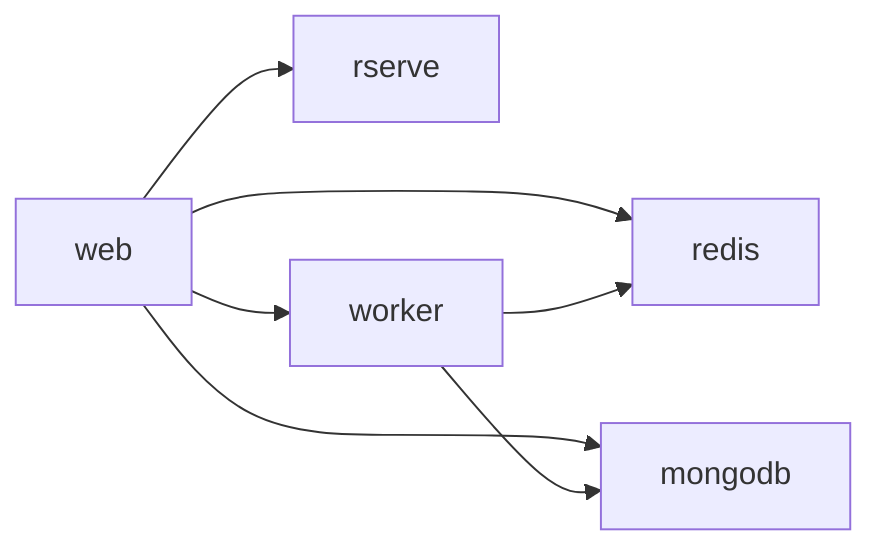

# Getting Started: Single-Node Dev Cluster Walkthrough

This guide walks you from zero to a running OpenStudio Server stack on a **single developer machine** running macOS or Linux.

---

## Quick Start (5 minutes)

If you have **Docker Desktop** and **nomad-pack** installed, this is the fastest path:

```bash
# 1. Clone the repo
git clone https://github.com/anchapin/openstudio-server-nomad-pack.git
cd openstudio-server-nomad-pack

# 2. Start Consul + Nomad in Docker (one command)
make up

# 3. Deploy OpenStudio Server (one command)
make deploy

# 4. Open the web UI
make open            # opens http://localhost:8080
```

**That's it.** The `make up` target runs Consul and Nomad in Docker containers using host networking, so Nomad can launch task containers on your local Docker daemon. See [`docker/docker-compose.yaml`](../docker/docker-compose.yaml) for details.

### What you get

| Address | Service |
|---|---|
| `http://localhost:8080` | OpenStudio Server Web UI |
| `http://localhost:4646` | Nomad UI |
| `http://localhost:8500` | Consul UI |

### Teardown

```bash
make down   # Stops the job, removes containers + volumes
```

### Prerequisites for Quick Start

| Tool | Minimum Version | Install |
|---|---|---|
| [Docker Desktop](https://docs.docker.com/get-docker/) | **24.0** (with Compose v2) | Docker Desktop for macOS or Docker Engine for Linux |
| [nomad-pack](https://developer.hashicorp.com/nomad/tools/nomad-pack) | **0.4.2+** | `brew install hashicorp/tap/nomad-pack` |
| `curl` + `python3` | system | Pre-installed on macOS/Linux (used by `make status`) |

> **macOS note**: Requires Docker Desktop **4.29+** for host-networking support. On older versions, use the detailed walkthrough below.  
> **Linux note**: The Nomad Docker driver connects to the host's Docker socket (`/var/run/docker.sock`) — ensure your Docker daemon is listening on the default socket path. No CNI plugins or `sudo` needed.

### Troubleshooting Quick Start

| Symptom | Fix |
|---|---|
| `make: nomad-pack: Command not found` | Install: `brew install hashicorp/tap/nomad-pack` |
| `make: docker: command not found` | Install Docker Desktop from https://docs.docker.com/get-docker/ |
| `make up` hangs | Run `docker compose -f docker/docker-compose.yaml logs` to check for errors |
| Port 4646 or 8500 already in use | Stop any existing Nomad/Consul processes first |
| `network_mode: host` warning on macOS | Upgrade Docker Desktop to 4.29+, or use the detailed walkthrough |

### Quick reference

```bash
make up       # Start Consul + Nomad in Docker
make deploy   # Deploy OpenStudio Server (nomad-pack run)
make open     # Open web UI in browser
make status   # Show job/node/service status
make web      # Tail web allocation logs
make logs     # Tail Nomad agent logs
make down     # Stop everything + clean volumes
make redeploy # Re-deploy after config changes
```

> For a full description of every variable and override option, see [docs/variables.md](../variables.md).

---

## Detailed Walkthrough (manual setup)

For environments where Docker Compose is not suitable (older Docker, air-gapped, multi-node, or you want native Nomad/Consul), use the full manual setup below.

## Service Topology



---

## Prerequisites

Install and verify the following before continuing.

| Tool | Minimum Version | Install |
|---|---|---|
| [Nomad](https://developer.hashicorp.com/nomad/install) | **1.7.0** | `brew install hashicorp/tap/nomad` |
| [Consul](https://developer.hashicorp.com/consul/install) | **1.17.0** | `brew install hashicorp/tap/consul` |
| [Docker](https://docs.docker.com/get-docker/) | **24.0** | Docker Desktop (macOS) or Docker Engine (Linux) |
| [CNI plugins](https://github.com/containernetworking/plugins) | **1.4.0** | See below |
| [nomad-pack](https://developer.hashicorp.com/nomad/tools/nomad-pack) | **0.4.2+** | `brew install hashicorp/tap/nomad-pack` |

### Install CNI plugins (Linux)

Nomad requires CNI plugins for bridge networking. On macOS with Docker Desktop, CNI is bundled — skip this step.

```bash
CNI_VERSION=v1.4.0
curl -sL "https://github.com/containernetworking/plugins/releases/download/${CNI_VERSION}/cni-plugins-linux-amd64-${CNI_VERSION}.tgz" \
  | sudo tar -xz -C /opt/cni/plugins
```

Verify:

```bash
ls /opt/cni/plugins/bridge
# Expected: /opt/cni/plugins/bridge
```

### Verify all tools

```bash
nomad version          # Nomad v1.7.x
consul version         # Consul v1.17.x
docker version --format '{{.Server.Version}}'
nomad-pack version     # nomad-pack v0.4.x
```

### Apple Silicon / ARM

If you are on an Apple M-series Mac and want to run the multi-VM Vagrant dev topology (`Vagrantfile`), use one of these provider paths:

1. **Parallels Desktop + vagrant-parallels (recommended)**
   - Install Parallels Desktop 18+ from https://www.parallels.com/
   - Install plugin:
     ```bash
     vagrant plugin install vagrant-parallels
     ```
2. **VMware Fusion + VMware Vagrant provider**
   - Install VMware Fusion (Personal Use license available): https://www.vmware.com/products/desktop-hypervisor/workstation-and-fusion
   - Install plugin:
     ```bash
     vagrant plugin install vagrant-vmware-desktop
     ```
3. **Lima (Apple Virtualization Framework via `vmType: vz`)**
   - Install Lima: https://lima-vm.io/
     ```bash
     brew install lima
     ```
   - Minimal `lima.yaml` template (copy and adjust per VM: `consul`, `nomad-server`, `nomad-client`, `vault`):
     ```yaml
     vmType: vz
     rosetta:
       enabled: true
       binfmt: true
     cpus: 2
     memory: "4GiB"
     disk: "40GiB"
     mounts:
       - location: "~"
         writable: true
     provision:
       - mode: system
         script: |
           #!/bin/bash
           apt-get update
           apt-get install -y docker.io
     ```
   - Start four Lima instances (one per role) and size them to mirror the Vagrant topology:
     ```bash
     limactl start --name consul lima.yaml
     limactl start --name nomad-server lima.yaml
     limactl start --name nomad-client lima.yaml
     limactl start --name vault lima.yaml
     ```

---

## Step 1 — Configure and Start Consul

Create a minimal Consul agent config. Consul must be running before Nomad starts so that service registration works.

```hcl
# consul-dev.hcl
server           = true
bootstrap_expect = 1
data_dir         = "/tmp/consul-data"
log_level        = "WARN"
ui_config { enabled = true }
```

Start Consul in the background:

```bash
consul agent -config-file consul-dev.hcl &
```

Expected output (last line):

```
[INFO]  agent: Started DNS server: address=127.0.0.1:8600 network=udp
```

Verify it is healthy:

```bash
consul members
# Node          Address         Status  Type    Build   Protocol  DC   Partition  Segment
# <hostname>  127.0.0.1:8301  alive   server  1.17.x  2         dc1  default    <all>
```

---

## Step 2 — Configure and Start Nomad

Create a minimal Nomad config. The `host_volume` blocks pre-declare named volumes on your local filesystem — they are required when deploying with persistent storage.

### macOS (Docker Desktop)

> **macOS note**: Docker Desktop bind-mounts only paths under `/Users` by default. Use paths under your home directory for `path` values, or add `/data` to Docker's "File Sharing" list in Preferences → Resources → File Sharing.

```hcl
# nomad-dev.hcl
data_dir  = "/tmp/nomad-data"
log_level = "WARN"
bind_addr = "127.0.0.1"

server {
  enabled          = true
  bootstrap_expect = 1
}

client {
  enabled = true

  host_volume "openstudio-mongodb" {
    path      = "/Users/<your-username>/nomad-volumes/mongodb"
    read_only = false
  }

  host_volume "openstudio-redis" {
    path      = "/Users/<your-username>/nomad-volumes/redis"
    read_only = false
  }
}

consul {
  address = "127.0.0.1:8500"
}

plugin "docker" {
  config {
    volumes { enabled = true }
  }
}
```

Replace `<your-username>` with the output of `whoami`. Then create the volume directories:

```bash
mkdir -p ~/nomad-volumes/mongodb ~/nomad-volumes/redis
```

### Linux

```hcl
# nomad-dev.hcl
data_dir  = "/opt/nomad/data"
log_level = "WARN"
bind_addr = "127.0.0.1"

server {
  enabled          = true
  bootstrap_expect = 1
}

client {
  enabled = true

  host_volume "openstudio-mongodb" {
    path      = "/opt/nomad/volumes/mongodb"
    read_only = false
  }

  host_volume "openstudio-redis" {
    path      = "/opt/nomad/volumes/redis"
    read_only = false
  }
}

consul {
  address = "127.0.0.1:8500"
}

plugin "docker" {
  config {
    volumes { enabled = true }
  }
}
```

Create directories (Linux requires root for `/opt`):

```bash
sudo mkdir -p /opt/nomad/volumes/mongodb /opt/nomad/volumes/redis
sudo chown -R "$(id -u):$(id -g)" /opt/nomad/volumes
```

### Start Nomad

```bash
sudo nomad agent -config nomad-dev.hcl &
```

Verify the agent is healthy:

```bash
nomad server members
# Name                  Address    Port  Status  Leader  Raft Version  Build  Datacenter  Region
# <hostname>.global  127.0.0.1  4648  alive   true    3             1.7.x  dc1         global

nomad node status
# ID        DC   Name        Class   Drain  Eligibility  Status
# <id>  dc1  <hostname>  <none>  false  eligible     ready
```

---

## Step 3 — Clone the Repository

```bash
git clone https://github.com/anchapin/openstudio-server-nomad-pack.git
cd openstudio-server-nomad-pack
```

---

## Step 4 — Create an Override File

The repository ships with `examples/quickstart/minimal-dev.hcl` which is ready to use out of the box for a single-node dev cluster with ephemeral storage.

If you want persistent storage (data survives allocation restarts), use the following override instead. Save it as `my-override.hcl` in the repo root:

```hcl
# my-override.hcl — single-node dev with persistent host volumes

job_name    = "openstudio-server-dev"
datacenters = ["dc1"]

# Persistent host volumes (must match host_volume names in nomad-dev.hcl)
db_storage_type  = "host_volume"
db_volume_source = "openstudio-mongodb"
redis_storage_type    = "host_volume"
redis_volume_source   = "openstudio-redis"

# Minimal resources for a developer laptop
web_cpu      = 300
web_memory   = 512
db_cpu       = 300
db_memory    = 512
redis_cpu    = 128
redis_memory = 256
worker_cpu   = 1000
worker_memory = 2048

# One worker, no autoscaling
worker_count               = 1
worker_autoscaling_enabled = false

# Disable optional sidecars to reduce image-pull time
enable_vector_collection  = false
enable_consul_connect     = false
enable_batch_verification = false

# No Vault, no backups for local dev
vault_integration_enabled  = false
vault_enabled              = false
enable_vault_mongo_secrets = false
backup_enabled             = false
restore_enabled            = false
```

> Backup and restore jobs are disabled by default. Enable `backup_enabled = true` and/or `restore_enabled = true` only after you have provisioned the `openstudio-backups` host/CSI volume used by `backup_nfs_host_volume`.

For the fastest zero-to-running experience (no persistent volumes needed), use the pre-built ephemeral config:

```bash
# Use the bundled minimal-dev.hcl (ephemeral storage, no host_volume setup needed)
cp examples/quickstart/minimal-dev.hcl my-override.hcl
```

---

## Step 5 — Deploy with nomad-pack

```bash
nomad-pack run -var-file my-override.hcl packs/openstudio-server
```

Expected output:

```
Pack successfully deployed. Monitor the deployments status using the below evaluation ID:
Evaluation ID: <eval-id>
```

---

## Step 6 — Verify All 6 Services Reach `running`

Check the job status:

```bash
nomad job status openstudio-server-dev
```

Expected output (truncated):

```
ID            = openstudio-server-dev
Name          = openstudio-server-dev
...
Status        = running
...

Task Groups
Group          Queued  Starting  Running  Failed  Complete  Lost
db             0       0         1        0       0         0
redis          0       0         1        0       0         0
rserve         0       0         1        0       0         0
web            0       0         1        0       0         0
web-background 0       0         1        0       0         0
worker         0       0         1        0       0         0
```

All 6 groups (`db`, `redis`, `rserve`, `web`, `web-background`, `worker`) should show `1` in the `Running` column.

### Check individual allocation status

```bash
nomad job status -verbose openstudio-server-dev | grep -A 30 "Allocations"
```

### Check Consul service registrations

```bash
consul catalog services | grep openstudio
# openstudio-db
# openstudio-redis
# openstudio-rserve
# openstudio-web
```

Each service should appear healthy:

```bash
consul health status openstudio-web
# Node       CheckID               Status  Output
# <node>  service:openstudio-web  passing  ...
```

### Tail logs for a specific task

```bash
# Replace <alloc-id> with an ID from `nomad job status`
nomad alloc logs <alloc-id> web
```

---

## Step 7 — Access the Web UI

### Option A: Direct port (simplest)

The web service listens on port **8080**:

```bash
open http://localhost:8080
# or
curl -s http://localhost:8080/up
# Expected: "ok" or HTTP 200
```

### Option B: Consul DNS

If your system resolver is configured to forward `.consul` queries to Consul (port 8600), you can access the UI via:

```
http://openstudio-web.service.consul:8080
```

To enable Consul DNS on macOS:

```bash
sudo mkdir -p /etc/resolver
echo "nameserver 127.0.0.1
port 8600" | sudo tee /etc/resolver/consul
```

---

## Common Errors

### Port conflict on startup

**Symptom**: `Error starting agent: listen tcp 0.0.0.0:4646: bind: address already in use`

**Fix**: Another Nomad process is already running. Find and stop it:

```bash
lsof -i :4646 | awk 'NR>1{print $2}' | xargs kill
```

### Volume `permission denied`

**Symptom**: Allocation fails with `permission denied` when mounting a host volume.

**Fix**: Ensure the volume directory exists and is owned by the user running the Nomad client:

```bash
# macOS
ls -la ~/nomad-volumes/

# Linux
ls -la /opt/nomad/volumes/
sudo chown -R "$(id -u):$(id -g)" /opt/nomad/volumes/
```

On macOS + Docker Desktop, also verify the path is listed under Docker Preferences → Resources → File Sharing.

### Image pull failure (`no such image`)

**Symptom**: Allocation shows `Failed` with `docker: Error response from daemon: pull access denied`.

**Fix**: Ensure Docker is running and can reach Docker Hub:

```bash
docker pull nrel/openstudio-server:latest
docker pull mongo:4.2
docker pull redis:6.2-alpine
```

If you are behind a proxy or firewall, see `examples/advanced/airgapped.hcl` for private-registry overrides.

### Consul service not registered

**Symptom**: `consul catalog services` does not show `openstudio-db` or `openstudio-redis` even after allocations are running.

**Fix**: Confirm Nomad is configured to talk to Consul:

```bash
nomad node status -verbose | grep consul
```

The Nomad `consul` block in `nomad-dev.hcl` must point to the correct address. Restart Nomad after any config change.

### `prestart` task keeps looping

**Symptom**: The `web` group stays in `Starting` for several minutes.

**Explanation**: The `web` task group includes a `prestart` init task that waits for `openstudio-db`, `openstudio-redis`, and `openstudio-rserve` to be registered as healthy in Consul before starting the web container. This is expected on first deploy while images are being pulled. Wait up to 5 minutes on a slow connection.

To check what the prestart task is waiting on:

```bash
nomad alloc logs <web-alloc-id> prestart-check
```

---

## Tearing Down

```bash
nomad job stop -purge openstudio-server-dev
```

To also remove persisted data:

```bash
# macOS
rm -rf ~/nomad-volumes/mongodb ~/nomad-volumes/redis

# Linux
sudo rm -rf /opt/nomad/volumes/mongodb /opt/nomad/volumes/redis
```

---

## Next Steps

- **Production deployment**: see `examples/advanced/production-ha.hcl` for a multi-datacenter, HA configuration.
- **Air-gapped environments**: see `examples/advanced/airgapped.hcl` for private registry image overrides.
- **Variable reference**: see [docs/variables.md](../variables.md) for all configurable options.
- **Vault integration**: see [docs/infrastructure/vault-policies.md](../infrastructure/vault-policies.md) for secret management setup.
- **Kubernetes migration**: see [docs/infrastructure/migration-k8s-to-nomad.md](../infrastructure/migration-k8s-to-nomad.md) if you are moving from Helm.

---

## Optional: Deploy Traefik Ingress

The pack can optionally deploy a [Traefik](https://traefik.io/) ingress controller alongside the OpenStudio Server stack. Traefik uses the Consul catalog provider to automatically pick up the `openstudio-web` service and route HTTP traffic to it.

To enable it, set `deploy_traefik = true`:

```bash
nomad-pack run -var "deploy_traefik=true" packs/openstudio-server
# or with a var-file:
nomad-pack run -var-file examples/quickstart/minimal-dev.hcl -var "deploy_traefik=true" packs/openstudio-server
```

This renders and deploys an additional `<job_name>-traefik` job with:

| Port | Purpose |
|------|---------|
| `traefik_http_port` (default `80`) | HTTP entrypoint |
| `traefik_https_port` (default `443`) | HTTPS entrypoint |
| `traefik_dashboard_port` (default `8080`) | Traefik dashboard (insecure, dev only) |

The Traefik dashboard is accessible at `http://<node-ip>:8080/dashboard/` after deployment.

> **Note**: `deploy_traefik = true` is the default. Omit the variable to deploy Traefik, or set `deploy_traefik = false` to disable it.
