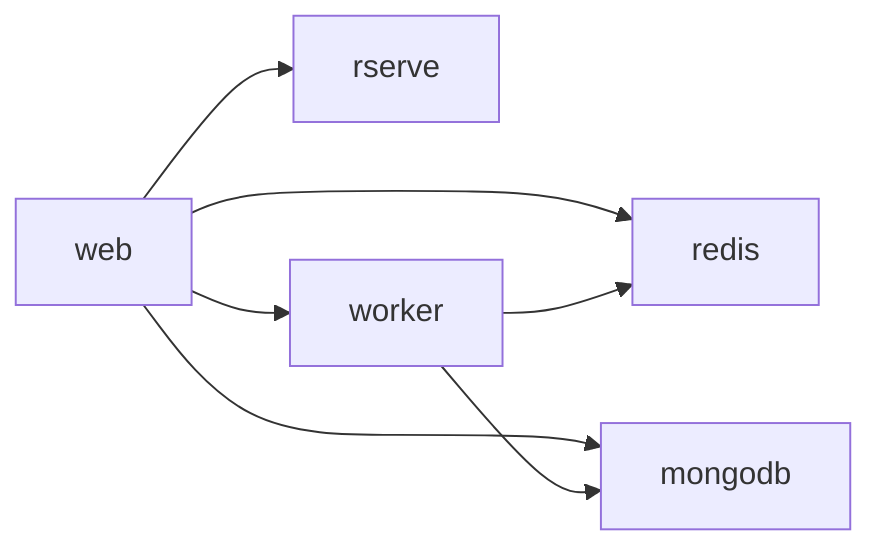

# OpenStudio Server Nomad Pack — Operations Guide

This page is the single entry point for all operational documentation. Each section below
describes a topic and links to the dedicated guide that covers it in depth.

---

## Service Topology

The `web` task group blocks on a `prestart` check that waits for `openstudio-db` and
`openstudio-redis` to be healthy in Consul before the web container starts.

---

## Guides

### 🚀 Getting Started: Single-Node Dev Cluster

**[docs/getting-started-single-node.md](./getting-started-single-node.md)**

Start here if you are deploying for the first time on a developer laptop or a single-node test
environment. Covers:

- Prerequisites (Nomad, Consul, CNI plugins, Docker, nomad-pack versions)
- Agent config snippets for macOS and Linux with `host_volume` enabled
- Full `nomad-pack run` command with a minimal override file
- How to verify all six services reach `running`
- Access instructions for the OpenStudio Server web UI
- Common errors and their fixes (port conflicts, volume permission denied, image pull failures)

---

### 💾 Storage Preparation

**[docs/storage.md](./storage.md)**

Covers everything you need to provision persistent storage *before* running `nomad-pack run`:

- Step-by-step instructions for registering a CSI plugin job and verifying plugin health
- `host_volume` stanza configuration for the Nomad client agent config
- Persistent volume examples for MongoDB and Redis data directories
- Volume permissions and UID/GID ownership requirements per service container
- Teardown and cleanup steps to avoid orphaned volumes

---

### 📋 Variable Reference

**[docs/variables.md](./variables.md)**

Full reference for every pack variable sourced directly from `variables.hcl`:

- Complete table: name, type, default, description, example override
- Annotated override file examples: minimal dev, production HA, air-gapped/private-registry
- Notes on variable interactions (e.g., `worker_count` vs. resource limits, Vault toggle flow)

---

### 🔐 Nomad ACL Policy Setup

**[docs/acl-policies.md](./acl-policies.md)**

Minimum ACL capabilities required to deploy and manage this pack:

- HCL policy files for operator, read-only, and CI/CD service token roles
- Commands to create policies and generate tokens
- Scoping policies to a specific Nomad namespace

---

### 🔑 Vault Policy Setup

**[docs/vault-policies.md](./vault-policies.md)**

HashiCorp Vault integration for secrets management:

- Vault policy HCL for each service that reads secrets (web, web-background, worker)
- `vault` stanza with `change_mode` and `change_signal` examples
- Nomad ≥ 1.7 labeled `vault` block vs. legacy Nomad < 1.7 stanza syntax
- KV v2 secret path conventions and token TTL / renewal recommendations
- Enabling the Nomad secrets engine in Vault

---

### 🔄 Kubernetes-to-Nomad Migration

**[docs/migration-k8s-to-nomad.md](./migration-k8s-to-nomad.md)**

Step-by-step migration from the [NREL openstudio-server Helm chart](https://github.com/NREL/openstudio-server):

- Pre-migration checklist: data backups, DNS/Consul service name mapping, image registry access
- Side-by-side Helm `values.yaml` → Nomad Pack variable mapping table
- MongoDB data migration (mongodump / mongorestore with volume mount examples)
- Redis persistence migration steps
- Post-migration smoke-test commands for all six services
- Rollback procedure if migration fails

---

## Quick-Reference: Pack Variables

| Variable | Default | What it does |
|----------|---------|--------------|
| `job_name` | `openstudio-server` | Nomad job name |
| `datacenters` | `["dc1"]` | Eligible datacenters |
| `worker_count` | `1` | Number of worker replicas |
| `worker_autoscaling_enabled` | `false` | Enable Nomad Autoscaler |
| `mongodb_storage_type` | `host_volume` | `host_volume`, `csi`, or `ephemeral` |
| `redis_storage_type` | `host_volume` | `host_volume`, `csi`, or `ephemeral` |
| `vault_integration_enabled` | `false` | Enable Vault secrets injection |
| `vault_enabled` | `false` | Render Vault `vault` blocks in jobs |
| `enable_consul_connect` | `false` | Enable Consul Connect mTLS mesh |
| `backup_enabled` | `false` | Enable MongoDB backup batch job |

See the full reference in [docs/variables.md](./variables.md).

---

## Deployment Checklist

Before running `nomad-pack run` for the first time:

- [ ] Nomad cluster is running and all client nodes are `ready`
- [ ] Consul is running and the Nomad–Consul integration is configured
- [ ] `host_volume` stanzas are added to every eligible Nomad client config **and** the client has been reloaded, _or_ CSI volumes are registered
- [ ] Volume directories exist and are owned by UID/GID `999` (MongoDB and Redis container user)
- [ ] Docker can pull required images on every Nomad client node
- [ ] If ACLs are enabled: operator token exported as `NOMAD_TOKEN`
- [ ] If Vault is enabled: secrets written to the correct KV v2 paths and Nomad policies applied

---

## Further Reading

- [Nomad Pack documentation](https://developer.hashicorp.com/nomad/tools/nomad-pack)
- [Nomad documentation](https://developer.hashicorp.com/nomad/docs)
- [Consul documentation](https://developer.hashicorp.com/consul/docs)
- [Vault documentation](https://developer.hashicorp.com/vault/docs)
- [OpenStudio Server (upstream)](https://github.com/NREL/openstudio-server)
