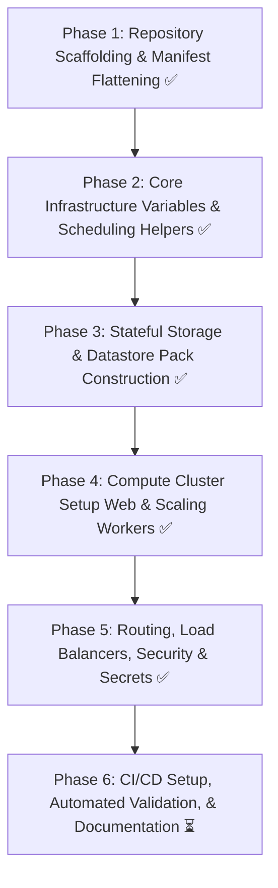

Note: the links and images in this document may point to external sources. Please review them before opening.

# Product Requirements Document (PRD) & Technical Plan: OpenStudio Server Nomad Pack

## 1. Executive Summary & Project Purpose

### 1.1 Overview

This document outlines the product requirements and a comprehensive, step-by-step technical implementation plan for creating `openstudio-server-nomad-pack`. This new, dedicated repository is the HashiCorp Nomad equivalent of the existing `openstudio-server-helm` Kubernetes repository.

Instead of deploying the distributed OpenStudio Server stack (for large-scale parametric building energy model simulations) onto a Kubernetes cluster via Helm charts, this pack enables deployment onto lighter-weight Nomad clusters. It utilizes HashiCorp Consul for service discovery, dynamic configurations, and internal networking, with optional support for HashiCorp Vault for secure secrets provisioning.

### 1.2 Target Audience & Business Value

- **Bare-Metal & On-Premise Clusters**: Teams that run on physical hardware without the operational overhead of a full Kubernetes distribution (e.g., control plane, complex networking overlays).
- **HashiCorp-Standardized Environments**: Organizations that have already standardized on the HashiCorp product stack (Nomad, Consul, Vault, Terraform).
- **Resource Optimization**: Nomad + Consul acts as a highly efficient orchestrator, leaving more raw CPU/RAM available on host instances to run computationally intensive OpenStudio simulations.

---

## 2. Kubernetes-to-Nomad Architectural Mapping

Because there is no automated YAML-to-HCL conversion tool, the translation must be handled manually, block-by-block. Below is the fundamental structural mapping that will guide the engineering team throughout development.

| Kubernetes/Helm Resource | Nomad Pack Equivalent | Architectural Translation Strategy |
| :--- | :--- | :--- |
| **Helm Chart** | Nomad Pack | A pack containing `metadata.hcl`, `variables.hcl`, and Go-templated `.nomad.tpl` job specs. |
| **values.yaml** | variables.hcl | Flat HCL variables mapping directly to the values structure. |
| **Deployment / Pod** | Job &rarr; Task Group | A Nomad Job contains one or more Task Groups (groups of tasks co-located on the same node). |
| **Container** | Task (docker driver) | Individual tasks running within the task group, mapped via the Docker task driver. |
| **Service** | `service` stanza (Consul) | Embedded directly inside the task/group definition. Automatically registers services in the Consul Service Registry. |
| **ConfigMap / Secret** | `template` stanza | Sourced from local static values, Consul KV, or dynamic paths in HashiCorp Vault. |
| **HPA / KEDA ScaledObject** | Nomad Autoscaler + Prometheus | Uses the Nomad Autoscaler daemon executing scaling policies based on Prometheus APM metrics. |
| **PodDisruptionBudget (PDB)** | `update` / `migrate` stanzas | Defined at the group level to control parallel updates, canary rates, and node drain behavior. |
| **StorageClass / PVC** | `volume` stanza & CSI Plugin | Native integration with Container Storage Interface (CSI) plugins (e.g., NFS, EBS) or local `host_volume` bindings. |
| **ServiceAccount / RBAC** | Nomad ACL Policies & Vault Roles | Workload-level security utilizing Nomad ACL tokens and Vault role-based engine integrations. |
| **Helm Hooks** (pre-delete, etc.) | lifecycle tasks & batch jobs | Tasks run with lifecycle hooks (`prestart`, `poststart`, `poststop`) or standalone batch / sysbatch jobs. |

---

## 3. Comprehensive Component Translation Strategy

Every subdirectory and template within `openstudio-server/templates/` must be mapped to its corresponding Nomad structure. The mapping details are specified below:

### 3.1 web/ and web-background/

- **Helm Origin**: `web-deploy.yaml`, `web-svc.yaml`, `web-hpa.yaml`, `web-runtime-overrides.yaml`, `web-background-deploy.yaml`, `web-background-hpa.yaml`
- **Nomad Mapping**:
  - **Job Name**: `openstudio-server-web`
  - **Task Group**: Contains a `web` task running the main UI/API server, and a `web-background` task running background workers or helper processes (if co-location makes sense). Otherwise, deploy `web-background` as a separate task group to scale it independently.
  - **Networking**: Integrate a `service` stanza in the `web` task to register the server in Consul with port mappings (80 or 8080). Include health checks targeting `/` or health status endpoints.
  - **Autoscaling**: Embed a `scaling` policy stanza pointing to the Nomad Autoscaler. Use CPU/RAM metrics gathered by Prometheus as the scaling trigger.

### 3.2 worker/

- **Helm Origin**: `worker-deploy.yaml`, `worker-hpa.yaml`, `worker-keda.yaml`, `worker-pdb.yaml`
- **Nomad Mapping**:
  - **Job Name**: `openstudio-server-worker` (Service/System job depending on requirements; typically a service job with multiple replicas).
  - **Queue-based Autoscaling**: Kubernetes uses KEDA to autoscale workers based on queue depth (e.g., RabbitMQ or MongoDB collections). On Nomad, configure the Nomad Autoscaler with a custom query target pointing to Prometheus or RabbitMQ APIs to monitor queue length, dynamically adjusting the task group count.
  - **Disruption Budget**: Instead of K8s PodDisruptionBudget, implement an explicit `update` stanza:
    ```hcl
    update {
      max_parallel     = 1
      health_check     = "checks"
      min_healthy_time = "10s"
      healthy_deadline = "5m"
      auto_revert      = true
    }
    ```

### 3.3 db/ (MongoDB / Database backend)

- **Helm Origin**: `db-deploy.yaml`, `db-svc.yaml`, `db-pvc.yaml`
- **Nomad Mapping**:
  - **Job Name**: `openstudio-server-db`
  - **Task Group**: Single-replica database group. Must mount persistent storage.
  - **Storage Binding**: Use a Nomad `volume` block linking to a registered Container Storage Interface (CSI) volume or a dedicated local `host_volume` defined on stateful Nomad nodes.
  - **Consul Service**: Register `openstudio-db` with port 27017 in Consul, enabling the web and worker tasks to discover it dynamically.

### 3.4 redis/

- **Helm Origin**: `redis-deploy.yaml`, `redis-svc.yaml`, `redis-pvc.yaml`
- **Nomad Mapping**:
  - **Job Name**: `openstudio-server-redis`
  - **Task Group**: Single-replica Redis instance.
  - **Storage & Consul Service**: Registered in Consul on port 6379. Persisted via local fast `host_volume` or CSI.

### 3.5 rserve/

- **Helm Origin**: `rserve-deploy.yaml`, `rserve-svc.yaml`
- **Nomad Mapping**:
  - **Job/Task Group**: `rserve` task group running RServe Docker containers. Registered as `openstudio-rserve` in Consul on port 6311.

### 3.6 nfs/ and storageclass/

- **Helm Origin**: `nfs-pvc.yaml`, `storageclass.yaml`
- **Nomad Mapping**:
  - **Strategy**: NFS is critical for mounting shared analysis directories across distributed nodes. Create a setup document for registering CSI plugins on the Nomad cluster (e.g., `democratic-csi` or native NFS CSI drivers).
  - In the Nomad job files, declare external volume mounts:
    ```hcl
    volume "nfs-shared" {
      type      = "csi"
      read_only = false
      source    = "openstudio-nfs-share"
    }
    ```
  - Mount the volume in both `web` and `worker` task definitions to allow simultaneous file access.

### 3.7 loadbalancer/

- **Helm Origin**: Load balancer annotations, Ingress yaml files
- **Nomad Mapping**: Configure a Consul-integrated Ingress, such as Traefik, Fabio, or Consul API Gateway. Provide a standalone Traefik template in the pack or include direct Consul-integrated service tags (e.g., `traefik.http.routers.openstudio.rule=Host(...)`) to auto-route external incoming traffic.

### 3.8 secrets/app-secrets.yaml

- **Helm Origin**: `secrets/app-secrets.yaml`
- **Nomad Mapping**: Use the Nomad `template` stanza to render configuration files or environment variables on the fly. Integrate HashiCorp Vault securely:
  ```hcl
  template {
    data = <<EOH
    {{ with secret "secret/data/openstudio/db" }}
    MONGO_INITDB_ROOT_PASSWORD="{{ .Data.data.password }}"
    {{ end }}
    EOH
    destination = "secrets/file.env"
    env         = true
  }
  ```
  If Vault is not used, fallback to variables defined in `variables.hcl` and injected via Consul KV templates.

### 3.9 service-account/

- **Helm Origin**: Service Accounts, RBAC Roles, Bindings
- **Nomad Mapping**: Workloads are isolated using Nomad ACL policies and Nomad namespaces. Rather than mapping service accounts to pods, apply a Nomad ACL token configuration to jobs that require access to the Nomad API, and map Consul/Vault roles using native job identities.

### 3.10 priority-class/

- **Helm Origin**: `priority_high`, `priority_low`
- **Nomad Mapping**: Maps directly to Nomad's job-level `priority` stanza. For instance, assign priority 80 to critical system UI jobs and priority 40 to long-running batch simulation jobs.

### 3.11 hooks/

- **Helm Origin**: `image-prepull-daemonset`, `pre-delete-hook`, `registry-hosts-patch-daemonset`
- **Nomad Mapping**:
  - **Image Pre-pulling**: Use a Nomad system job (runs on every node matching constraints) with a short-lived `prestart` or lifecycle block to pull heavy OpenStudio simulation images to all compute nodes before jobs are dispatched.
  - **Pre-delete Hooks**: Handled using Nomad's `poststop` lifecycle hooks in task definitions, executing clean-up actions when the primary process exits.

### 3.12 _scheduling.tpl

- **Helm Origin**: Node affinity, tolerations, anti-affinity helpers
- **Nomad Mapping**: Create a reusable Go-template file `_helpers.tpl` in the `templates/` directory. Translate K8s affinities to Nomad `affinity` and `constraint` stanzas:
  ```hcl
  affinity {
    attribute = "${node.class}"
    value     = "compute"
    weight    = 50
  }
  ```

### 3.13 tests/

- **Helm Origin**: Helm test pods (e.g., `test-redis-ping`, `test-web-healthcheck`)
- **Nomad Mapping**: Packaged as a separate, parameterized Nomad batch job. It runs commands to ping Redis or execute curl checks against the Consul-registered `openstudio-web` service. Alternatively, embed Consul native TCP/HTTP health checks within service registrations to continuously monitor health.

---

## 4. Repository Structure Blueprint

This repository now lives at `anchapin/openstudio-server-nomad-pack` and follows a dual-layout model: a root runnable pack plus a registry-aligned pack under `packs/openstudio-server/`.

```text
openstudio-server-nomad-pack/
├── README.md                           # Primary operator docs
├── LICENSE*                            # Dual-license files (MIT + BSD-3-Clause)
├── .github/
│   └── workflows/                      # CI pipelines (validation, integration, release)
│       ├── acl-policy-validation.yml
│       ├── integration-test.yml
│       ├── pack-validation.yml
│       ├── release-version-bump.yml
│       └── release.yml
├── docs/                               # Deep-dive ops and migration documentation
├── examples/                           # Deploy scenario var-files
├── templates/                          # Root pack templates (source of truth)
│   ├── _helpers.tpl
│   ├── openstudio-server.nomad.tpl     # Architecture marker file (intentionally non-rendering)
│   ├── web.nomad.tpl
│   ├── worker.nomad.tpl
│   ├── db.nomad.tpl
│   ├── redis.nomad.tpl
│   ├── rserve.nomad.tpl
│   ├── system-hooks.nomad.tpl
│   ├── nomad-autoscaler.nomad.tpl
│   ├── batch-verification.nomad.tpl
│   ├── state-backup.nomad.tpl
│   ├── state-restore.nomad.tpl
│   ├── openstudio_test.nomad.tpl
│   └── traefik.nomad.tpl
└── packs/
    └── openstudio-server/
        ├── README.md                   # Registry-facing package README
        ├── metadata.hcl                # Mirrors root metadata.hcl
        ├── variables.hcl               # Mirrors root variables.hcl
        ├── outputs.tpl                 # Mirrors root outputs.tpl
        └── templates/                  # Mirrors root templates/*
```

---

## 5. Detailed Step-by-Step Implementation Roadmap



### Current implementation status (living roadmap)

1. **Delivered**
   - Split-job architecture implemented (`<job_name>-web`, `-worker`, `-db`, `-redis`, `-rserve`) with dedicated templates.
   - Web + web-background are co-defined in `web.nomad.tpl` with dependency prestart checks.
   - Worker includes rolling-update controls and optional autoscaling policy blocks.
   - Datastore persistence modes implemented for MongoDB and Redis (`host_volume`, `csi`, `ephemeral`).
   - Optional operational jobs implemented: image pre-pull system job, batch verification, state backup, state restore, OpenStudio test batch, optional Traefik job.
   - Registry mirror under `packs/openstudio-server/` is enforced by CI drift checks.

2. **In progress / open alignment work**
   - CI trigger and gating alignment improvements tracked in:
     - #237 (`pack-validation` PR trigger scope)
     - #239 (gating Consul app-service registration checks in integration)
     - #240 (integration workflow path coverage breadth)
   - README/PRD consistency cleanup tracked in:
     - #238

3. **Operational rule**
   - This PRD is updated whenever architecture, CI behavior, acceptance criteria, or template inventory changes.

---

## 6. Detailed Variable Mapping Blueprint

> Note: This section is illustrative. `variables.hcl` and `docs/variables.md` are the operational source of truth for current defaults and descriptions.

To maintain variable parity with `values.yaml` / `values.schema.json`, map configuration variables to HCL. Below is a sample mapping structure showing how inputs in `variables.hcl` should be defined.

```hcl
# packs/openstudio-server/variables.hcl

variable "app_version" {
  type        = string
  description = "Docker image tag for OpenStudio Server components"
  default     = "3.6.1"
}

variable "mongodb_storage_type" {
  type        = string
  description = "Persistent storage mechanism: 'csi' or 'host'"
  default     = "host"
}

variable "mongodb_volume_source" {
  type        = string
  description = "The registered CSI volume ID or host path volume identifier"
  default     = "mongodb-data"
}

variable "worker_min_replicas" {
  type        = number
  description = "Minimum number of simulation workers running"
  default     = 2
}

variable "worker_max_replicas" {
  type        = number
  description = "Maximum limit for worker scaling"
  default     = 50
}

variable "vault_integration_enabled" {
  type        = bool
  description = "If true, pull passwords/keys directly from Vault instead of variables"
  default     = false
}

variable "ingress_domain" {
  type        = string
  description = "Base domain pointing to load balancers"
  default     = "openstudio.local"
}
```

---

## 7. Migration Parity & Operational Discrepancies

This section details how to address features that behave differently on Nomad compared to Kubernetes:

### 7.1 Queue-Based Autoscaling (KEDA vs. Nomad Autoscaler)

- **Kubernetes (KEDA)**: KEDA queries external message brokers (e.g., RabbitMQ, MongoDB collections) directly and updates the K8s HPA target.
- **Nomad**: The Nomad Autoscaler queries Prometheus, which metrics collectors scrape from RabbitMQ/MongoDB. Ensure cluster metrics are exported to Prometheus. The Nomad Autoscaler then reads these Prometheus metrics to adjust worker task counts.

### 7.2 PodDisruptionBudget (PDB)

- **Kubernetes**: Imposes hard cluster rules preventing eviction of too many pods simultaneously during node maintenance.
- **Nomad**: Configured via the task group `update` or `migrate` blocks. For example, configure `max_parallel = 1` and `health_check = "checks"` to ensure rolling node upgrades occur sequentially without interrupting active simulation workers.

### 7.3 DaemonSets (Image Pre-pullers & Host Patchers)

- **Kubernetes**: Automatically schedules pods on all newly joined cluster hosts.
- **Nomad**: Handled by configuring job `prepull` with `type = "system"`. A system job runs exactly one instance on every eligible node, making it ideal for pulling large simulation Docker images before actual compute workloads are dispatched.

---

## 8. Final Acceptance Criteria

The `openstudio-server-nomad-pack` project is considered complete when the following verification milestones are met:

- **Repository Creation**: Repository is maintained at `anchapin/openstudio-server-nomad-pack` with root + registry pack layouts kept in sync.
- **Zero-Error Syntax**: Command `nomad-pack validate` executes successfully with no linter warnings.
- **Functional Local Deployment**: The entire stack successfully spins up on a standard single-node Nomad + Consul developer setup.
- **Stateful Database Health Checks**: MongoDB and Redis mount persistent volumes and retain database state across task restarts.
- **Consul Service Integration**: All components resolve service connections natively via Consul DNS names (e.g., `db.service.consul`).
- **Comprehensive Setup Documentation**: The README provides clear steps on setup, storage preparation, and variables overrides.
- **Automated CI Validation**: GitHub Actions block non-conforming or syntactically invalid PRs.

### 8.1 Acceptance status snapshot (as of 2026-07-28)

| Criterion | Status | Notes |
| :--- | :--- | :--- |
| Repository Creation | ✅ Met | Repository and dual pack layout are in place. |
| Zero-Error Syntax | ✅ Met | Validation workflows and local commands are present. |
| Functional Local Deployment | ✅ Met | Single-node guide and example var-files are provided. |
| Stateful DB Health Checks | ✅ Met | Persistent volume modes implemented for MongoDB/Redis. |
| Consul Service Integration | ⚠️ Partially gated in CI | Integration workflow asserts Nomad+Consul registration; stronger app-service gating tracked in #239. |
| Comprehensive Setup Documentation | ⚠️ In progress | Documentation exists; README consistency fixes tracked in #238. |
| Automated CI Validation | ⚠️ In progress | CI is substantial but trigger/gating scope improvements tracked in #237 and #240. |